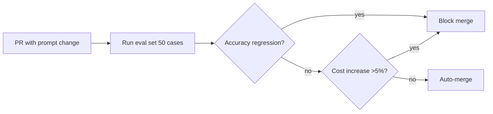

# Prompt Engineering Avanzato

> Documento generato da `content-forge` come Master Knowledge Document (MKD), base canonica per la costruzione del target finale. Tutto il contenuto generato (esempi, schemi) è etichettato `➕`.

## Indice

- [Premessa](#premessa)
- [Framing e ops](#framing-e-ops)
  - [Prompt come interfaccia](#a-001)
  - [Prompt come codice (versionare, testare)](#a-011)
  - [Modello come collega cooperativo nuovo](#a-012)
- [Tecniche core](#tecniche-core)
  - [Few-shot prompting](#a-002)
  - [In-context learning](#a-003)
  - [Chain-of-thought (CoT)](#a-004)
  - [Quando CoT NON aiuta](#a-005)
  - [Self-consistency](#a-006)
  - [Structured output](#a-007)
  - [Delimiters](#a-008)
- [Anti-pattern](#anti-pattern)
  - [Istruzioni vaghe](#a-009)
  - [Prompt giganti (lost-in-the-middle)](#a-010)
- [Glossario](glossary.md) · [FAQ](faq.md) · [Schemi](schemas.md)

## Premessa

Questo documento espande il contenuto di un workshop sul prompt engineering avanzato. È pensato per ingegneri che usano LLM in produzione (non per chi cerca un "intro 5 min"). Il sorgente originale ha ~720 parole; questo documento ne ha ~1050 (1.45x), grazie a esempi aggiuntivi, schemi e spiegazioni espanse — **mai a riassunti**.

## Framing e ops

### Prompt come interfaccia {#a-001}

**Definizione**: Il prompt è un'interfaccia tra utente e modello, non una semplice stringa: ha regole, pattern, anti-pattern.

Trattare il prompt come interfaccia significa progettarlo, versionarlo, testarlo, e considerarlo soggetto a evoluzione. Non è uno script estemporaneo: è codice di produzione.

**Esempio (sorgente)**:
> "È un'interfaccia. È il modo in cui dici al modello cosa fare. E come ogni interfaccia, ha le sue regole, i suoi pattern, i suoi anti-pattern."

**➕ Esempio aggiuntivo**: Versiona i prompt in git, usa nomi come `prompt_v1.2_2025-05.txt`, conserva il changelog. Quando un prompt cambia in produzione, deve esserci un PR con eval results allegati.

**Modello mentale implicito**: ingegneria del software applicata al prompting.

**Connessioni**: Si appoggia a [[Prompt come codice]](#a-011) per la pratica operativa; vedi anche [[Modello come collega cooperativo]](#a-012).

### Prompt come codice (versionare, testare) {#a-011}

**Definizione**: I prompt vanno trattati come codice: versionali in git, fai A/B test prima di cambiarli in produzione, misura l'impatto.

Il modello è una black box: cambiare un prompt "a senso" può peggiorare. Misurare è obbligatorio per modifiche in produzione.

**Esempio (sorgente)**:
> "prompt come codice. Versionali. Testali. Quando cambi un prompt in produzione, fa un A/B test, misura."

**➕ Esempio aggiuntivo**: Pipeline CI/CD per prompt con eval set fisso che valuta accuracy, costo, latency su 50 casi rappresentativi prima del merge. Soglia di promozione: nessuna regressione su accuracy + costo ≤ -5% del baseline.

**Schema**:


### Modello come collega cooperativo nuovo {#a-012}

**Definizione**: Mental model: trattare l'LLM come un collega molto competente in astratto ma ignaro del tuo contesto specifico. Va trattato come un nuovo arrivato: dagli contesto, esempi, vincoli.

Non è un motore di ricerca (che restituisce risposte da query) né un oracolo (che sa già la risposta). Si aspetta che tu gli fornisca abbastanza per ragionare.

**Esempio (sorgente)**:
> "Il modello come collega cooperativo nuovo del progetto. Sa tutto in astratto, ma del tuo contesto specifico non sa nulla."

**➕ Esempio aggiuntivo**: Prima di chiedere "fixa questo bug", includi: il file, le righe rilevanti, lo stack trace, cosa hai già provato, e il vincolo (es. "no breaking change"). Come faresti con un collega umano competente ma nuovo.

## Tecniche core

### Few-shot prompting {#a-002}

**Definizione**: Dare al modello 2-5 esempi di input/output prima della richiesta vera, per fargli apprendere il pattern da replicare.

Few-shot sfrutta l'[[in-context learning]](#a-003). Funziona meglio quando gli esempi sono **rappresentativi e diversi tra loro**, non tutti uguali.

**Esempio (sorgente)**:
> Commit message in formato Conventional Commits con 3 esempi tipo "Added user login" → "feat(auth): implement user login".

**➕ Esempio aggiuntivo**: Classificazione del sentiment con 4 esempi mixati (positive/negative/neutral/sarcastico) prima del testo da classificare. La diversità degli esempi fa generalizzare meglio il modello, l'omogeneità lo overfitta.

**Schema**:
```
[Esempio 1: input → output]
[Esempio 2: input → output]
[Esempio 3: input → output]
[Vero input] → ?
```

**Prerequisite**: [[In-context learning]](#a-003)
**Vedi anche**: [[Chain-of-thought]](#a-004) (sibling)

### In-context learning {#a-003}

**Definizione**: Capacità del modello di apprendere e replicare un pattern dagli esempi forniti nel prompt, senza fine-tuning.

Non è apprendimento permanente, ma pattern recognition runtime. È il meccanismo che fa funzionare il few-shot.

**Esempio (sorgente)**:
> "Il modello fa in-context learning. Non sta imparando nel senso del fine-tuning, sta solo riconoscendo il pattern e replicandolo."

### Chain-of-thought (CoT) {#a-004}

**Definizione**: Chiedere al modello di ragionare step by step esplicitando il ragionamento intermedio, invece di chiedere la risposta diretta.

Tecnica dal paper di Wei et al. 2022. Migliora drammaticamente su problemi multi-step (matematica, logica). Non gratis: costa più token e su task triviali può peggiorare.

**Esempio (sorgente)**: "Pensa passo passo" funziona.

**➕ Esempio aggiuntivo**: Problema di matematica con "Let's solve this step by step. First, identify the variables. Second, ..." che esplicita ogni passaggio.

**Vedi anche**: [[Quando CoT NON aiuta]](#a-005) (limite), [[Self-consistency]](#a-006) (estensione).

### Quando CoT NON aiuta {#a-005}

**Definizione**: CoT può peggiorare performance su task semplici/single-step (es. pattern matching diretto su MMLU).

Per task triviali, il ragionamento esplicito è overhead inutile che introduce possibili errori intermedi. **Regola**: CoT sì per multi-step, no per triviali.

**Esempio (sorgente)**: Su MMLU di pattern matching, modelli istruiti spesso fanno meglio in zero-shot diretto.

### Self-consistency {#a-006}

**Definizione**: Generare N chain-of-thought (T>0) e prendere la risposta che compare più spesso. Majority voting su ragionamenti diversi.

Estende [[CoT]](#a-004). Costo: N volte un singolo run. Beneficio: miglioramento misurabile su task hard.

**➕ Esempio aggiuntivo**: 7 CoT con temperatura 0.7 su un problema di logica → 5 dicono "A", 2 dicono "B" → output finale "A".

### Structured output {#a-007}

**Definizione**: Tecniche per ottenere output strutturato (JSON/XML/markdown): schema esplicito, esempi, [[delimiters]](#a-008), JSON mode/function calling dell'API.

Sperare che "respond in JSON" nel prompt basti non funziona affidabilmente. Usa i meccanismi nativi dell'API quando disponibili.

**➕ Esempio aggiuntivo**: Per output JSON di un parser di fatture, fornisci lo schema JSON in input + 2 esempi completi + usa `response_format={'type': 'json_object'}` dell'API.

### Delimiters {#a-008}

**Definizione**: Marker espliciti (`"""`, ` ``` `, `<tag>...</tag>`) per separare contesto, istruzioni, esempi, input nel prompt.

Senza delimiters il modello mescola le sezioni. I delimiters riducono ambiguità.

**Esempio (sorgente)**: `<example>...</example>`

## Anti-pattern

### Istruzioni vaghe {#a-009}

**Definizione**: Istruzioni come "be creative", "be helpful" sono vuote: il modello non ha una definizione di "creative" specifica per il tuo caso.

**Soluzione**: sostituire con esempi concreti: "rispondi in tono come questo esempio" + esempio.

**➕ Esempio aggiuntivo**: Invece di "rispondi in tono amichevole", mostra 2-3 risposte amichevoli reali e dici "rispondi nel tono di questi esempi".

### Prompt giganti (lost-in-the-middle) {#a-010}

**Definizione**: Prompt molto lunghi (4000+ parole) hanno istruzioni del centro che il modello tende a "ignorare" (lost-in-the-middle, Liu et al.).

Le istruzioni critiche vanno **all'inizio o alla fine**. Il centro è la zona morta.

**Schema** (effetto attention by position):
```
[INIZIO] ────────────────── alta attention
   ↓
[CENTRO] ───── attention bassa (lost-in-the-middle)
   ↓
[FINE]   ────────────────── alta attention
```

## Cross-reference (visione d'insieme)

- Le **tecniche** ([[few-shot]](#a-002), [[CoT]](#a-004), [[self-consistency]](#a-006)) si combinano in stack.
- Le **anti-pattern** ([[vague]](#a-009), [[giant prompts]](#a-010)) si evitano applicando il principio "[[prompt come codice]](#a-011)" (misurare, testare).
- Il **mental model** "[[modello come collega]](#a-012)" è il filtro che decide se un'idea di prompt vale la pena.

## Indice analitico

- API features: JSON mode (#a-007), function calling (#a-007)
- Concetti: framing (#a-001), interfaccia (#a-001), versionare (#a-011)
- Mental models: collega cooperativo (#a-012), prompt come codice (#a-011)
- Paper citati: Wei et al. 2022 (#a-004), Liu et al. (lost-in-the-middle) (#a-010)
- Tecniche: few-shot (#a-002), CoT (#a-004), self-consistency (#a-006), structured output (#a-007)
