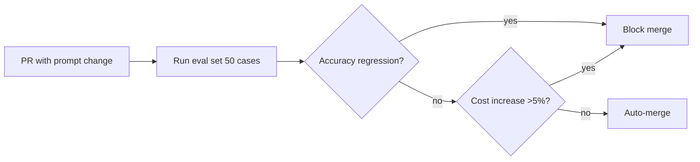

# Prompt Engineering Avanzato — Guida pratica

> Documento generato da `content-forge` adattando il Master Knowledge Document per audience senior. Contenuto generato (esempi, schemi) etichettato `➕`.

## Indice

- [Per chi è questa guida](#per-chi-e-questa-guida)
- [1. Framing: il prompt è codice di produzione](#framing)
  - [Prompt come interfaccia](#prompt-interfaccia)
  - [Prompt come codice (versionare, testare)](#prompt-codice)
  - [Il modello come collega cooperativo nuovo](#mental-model)
- [2. Tecniche core](#tecniche)
  - [Few-shot prompting](#few-shot)
  - [In-context learning (perché few-shot funziona)](#icl)
  - [Chain-of-thought (CoT)](#cot)
  - [Quando CoT NON aiuta](#cot-anti)
  - [Self-consistency](#sc)
  - [Structured output](#structured)
  - [Delimiters](#delimiters)
- [3. Anti-pattern da evitare](#anti-pattern)
- [Glossario](glossary.md) · [FAQ](faq.md)

## Per chi è questa guida

Ingegneri ML/AI che usano LLM in produzione, non in fase di esplorazione. Si assume familiarità con: API LLM (Anthropic/OpenAI), embedding, retrieval, tooling base.

Cosa NON c'è qui: introduzione a "cos'è un LLM" (assumiamo lo sai), basics di prompt engineering (assumiamo zero/few/CoT distinti li conosci), python implementation details (focus su pattern, non sintassi).

## 1. Framing: il prompt è codice di produzione {#framing}

### Prompt come interfaccia {#prompt-interfaccia}

Il prompt non è una stringa estemporanea. È un'**interfaccia**: ha contratti, versioni, anti-pattern, e va trattata con la stessa serietà di un endpoint REST.

**Esempio (sorgente)**:
> "È un'interfaccia. È il modo in cui dici al modello cosa fare. E come ogni interfaccia, ha le sue regole, i suoi pattern, i suoi anti-pattern."

**➕ In pratica**: versionali in git con nomi come `prompt_v1.2_2025-05.txt`, conserva il changelog. Quando un prompt cambia in produzione, deve esserci un PR con eval results allegati (più sotto, sezione "prompt come codice").

### Prompt come codice (versionare, testare) {#prompt-codice}

Tratta i prompt come codice: versionali, testali, fai A/B test prima di promuovere modifiche in produzione, misura.

Il modello è una **black box**: cambiare un prompt "a senso" può peggiorare in modi non ovvi.

**➕ Pipeline CI/CD per prompt** — esempio realistico:



Soglia di promozione tipica: nessuna regressione su accuracy, costo ≤ -5% del baseline, latency p95 ≤ baseline+10%.

### Il modello come collega cooperativo nuovo {#mental-model}

**Mental model fondamentale**: trattare l'LLM come un collega molto competente in astratto ma **ignaro del tuo contesto specifico**. Va trattato come un nuovo arrivato: dagli contesto, esempi, vincoli.

NON è:
- un motore di ricerca (che restituisce risposte da query)
- un oracolo (che sa già la risposta)

**Si aspetta che tu gli fornisca abbastanza per ragionare.**

**➕ In pratica**: prima di chiedere "fixa questo bug", includi: file, righe rilevanti, stack trace, cosa hai già provato, vincoli (es. "no breaking change"). Esattamente come faresti con un collega umano nuovo al progetto.

## 2. Tecniche core {#tecniche}

### Few-shot prompting {#few-shot}

Dare al modello **2-5 esempi** di input/output prima della richiesta vera, per fargli apprendere il pattern.

Funziona meglio quando gli esempi sono **rappresentativi e diversi** tra loro (non tutti uguali, non tutti edge case).

**Esempio (sorgente)**: Conventional Commits con 3 esempi tipo "Added user login" → "feat(auth): implement user login".

**➕ Caso reale**: classificazione del sentiment con 4 esempi mixati (positive/negative/neutral/sarcastico) prima del testo da classificare. La diversità fa generalizzare; l'omogeneità overfitta.

```
[Esempio 1: input → output]
[Esempio 2: input → output]
[Esempio 3: input → output]
[Vero input] → ?
```

### In-context learning (perché few-shot funziona) {#icl}

Il modello fa **pattern recognition runtime** sui tuoi esempi, NON apprendimento permanente.

Implicazione pratica: gli esempi devono essere nel **prompt corrente**, non in una conversazione passata che non viene ri-passata.

### Chain-of-thought (CoT) {#cot}

Chiedere al modello di **ragionare step by step**, esplicitando ogni passaggio, invece di chiedere la risposta diretta.

Tecnica dal paper di Wei et al. 2022. Migliora drammaticamente su problemi multi-step (matematica, logica, planning).

**➕ Esempio**: problema di matematica con "Let's solve this step by step. First, identify the variables. Second, ..." che esplicita ogni passaggio.

> **Nota di costo**: non gratis. Vedi sezione successiva.

### Quando CoT NON aiuta {#cot-anti}

CoT può **peggiorare** performance su task semplici/single-step (es. pattern matching diretto su MMLU).

Per task triviali, il ragionamento esplicito è overhead che introduce possibili errori intermedi.

**Regola operativa**: CoT sì per multi-step, **no** per triviali. Misura, non assumere.

### Self-consistency {#sc}

Estende CoT. Invece di una sola chain, ne generi **N (5-10)** con temperatura > 0, poi prendi la risposta che compare più spesso. **Majority voting** su ragionamenti diversi.

- **Costo**: N volte un singolo run
- **Beneficio**: miglioramento misurabile su task hard

**➕ Esempio reale**: 7 CoT con temperatura 0.7 su un problema di logica → 5 dicono "A", 2 dicono "B" → output finale "A".

### Structured output {#structured}

Tecniche per ottenere output strutturato (JSON/XML/markdown):
1. **Schema esplicito** nel prompt
2. **Esempi** di output ben formato
3. **Delimiters** (sezione successiva)
4. **JSON mode / function calling** dell'API quando disponibili

Sperare che "respond in JSON" basti **non funziona affidabilmente** in produzione.

**➕ Setup tipico per parser di fatture**: schema JSON in input + 2 esempi completi + `response_format={'type': 'json_object'}`. Accuracy va da ~80% (solo prompt) a ~98% (con response_format).

### Delimiters {#delimiters}

Marker espliciti (`"""`, ` ``` `, `<tag>...</tag>`) per separare contesto, istruzioni, esempi, input.

Senza delimiters il modello **mescola le sezioni**. Con, riduci ambiguità.

Esempi pratici di delimiter usati in produzione:
- `<context>...</context>`, `<instructions>...</instructions>`, `<example>...</example>`, `<user_input>...</user_input>`
- Tag XML sono spesso più robusti di triple-quote per testi complessi

## 3. Anti-pattern da evitare {#anti-pattern}

### Istruzioni vaghe

"Be creative", "be helpful", "respond well" sono **vuoti**: il modello non ha una definizione di "creative" specifica per il tuo caso.

**Soluzione**: sostituire con esempi concreti. "Rispondi nel tono di questi 2-3 esempi" + esempi reali.

### Prompt giganti (lost-in-the-middle)

Prompt molto lunghi (4000+ parole) soffrono di **lost-in-the-middle** (Liu et al.): istruzioni in mezzo vengono "ignorate" rispetto a quelle all'inizio o alla fine.

**Effetto attention by position**:
```
[INIZIO] ────────────────── alta attention
   ↓
[CENTRO] ───── attention bassa (lost-in-the-middle)
   ↓
[FINE]   ────────────────── alta attention
```

**Soluzione**: istruzioni critiche all'inizio o alla fine; mai in mezzo. Se devi avere context lungo, splittalo in passaggi distinti.

---

> Vedi [glossario](glossary.md) per i termini chiave e [FAQ](faq.md) per le obiezioni comuni.
