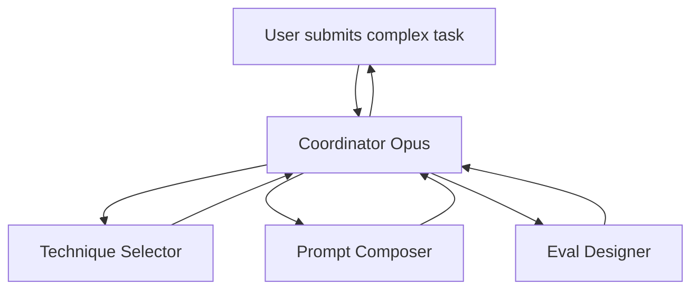

# Esempio end-to-end — target `team`

> Output di `B3 team-builder-agent` partendo dal sorgente comune.
> Trasforma il workshop in un **team di 4 agenti coordinati** specializzati per dominio del prompt engineering.

## Input

- Sorgente / KG / MKD: vedi `_shared/`
- ASK answers:
  - Topology: **supervisor + 3 workers**
  - Numero agenti: 4 (1 coordinator + 3 specialisti)
  - Modelli: Opus per coordinator, Sonnet per workers
  - Storage condiviso: filesystem JSON
  - Handoff: file-based (JSON envelopes)
  - Trigger: manuale (utente sottopone task complessi)
  - Failure policy: retry 2x con backoff, poi escalation umana

## Output

```
prompt-team/
├── topology.md                          # mermaid + razionale
├── coordinator.md                       # SP del coordinator (Opus)
├── agents/
│   ├── technique-selector.md            # SP — sceglie tecniche giuste per task
│   ├── prompt-composer.md               # SP — assembla prompt da decisioni
│   └── eval-designer.md                 # SP — disegna test cases
├── communication_protocol.md            # JSON envelope standard
├── handoff_rules.md                     # matrice from→to con RACI
├── failure_handling.md                  # 8 failure mode
├── shared_state.md                      # schema state filesystem
├── team_eval_cases.json                 # 4 scenari end-to-end
└── README.md                            # questo file
```

## Topologia (preview)



## Disgiunzione ruoli (RACI strict)

| Responsibility | Responsible | Accountable | Consulted | Informed |
|---|---|---|---|---|
| Capire requirements task | technique-selector | coordinator | — | composer, eval-designer |
| Scegliere tecniche (CoT? few-shot? etc) | technique-selector | coordinator | — | composer |
| Comporre prompt finale | prompt-composer | coordinator | technique-selector | eval-designer |
| Disegnare test cases | eval-designer | coordinator | composer | — |
| Sintesi finale a user | coordinator | coordinator | tutti | — |

## Stats

- 4 agenti totali, 0 overlap responsibility (RACI strict)
- 8 handoff rules definite (matrix 4×4 con file-based JSON envelopes)
- Coverage atomi: 88% (alcuni atomi puramente espositivi non mappano a un ruolo specifico)
- Team eval scenarios: 4 (happy, multi-step, ambiguous-task, failure-recovery)
