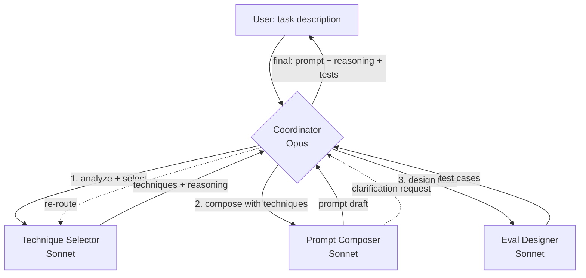

# Topology — prompt-team

## Topologia scelta: **supervisor + 3 workers**

## Razionale

Il task "scrivere un prompt per X" è multi-stage:
1. **Analisi**: cosa è il task? Single/multi-step? Structured?
2. **Selezione tecniche**: quali pattern (few-shot, CoT, ecc) si applicano?
3. **Composizione**: assembla il prompt vero
4. **Validazione**: come testarlo?

Ogni stage richiede expertise distinta. Topologia supervisor permette:
- Coordinator (Opus) tiene context complessivo, decompone task, valida
- Workers (Sonnet) specializzati su un singolo stage = SP più focused, meno costo
- Sequenza controllabile, debug facile

**Alternative scartate**:
- *Peer-to-peer*: troppo caotico per task strutturati
- *Pipeline pura*: troppo rigida, non gestisce loop (es. composer chiede chiarimenti al selector)
- *Hub-spoke*: i task non sono indipendenti (uno passa risultato all'altro)

## Diagramma

## Modelli per ruolo

| Ruolo | Modello | Perché |
|---|---|---|
| coordinator | claude-opus-4 | Richiede context lungo, decomposition, judgment |
| technique-selector | claude-sonnet-4 | Decisione strutturata, mid-complexity |
| prompt-composer | claude-sonnet-4 | Writing task, mid-complexity |
| eval-designer | claude-sonnet-4 | Pattern-based, mid-complexity |

## Costo stimato

Per task tipico:
- 1 turn Opus (coordinator) + 3 turn Sonnet (workers, paralleli quando possibile)
- ~25k token totali in vs ~3k token out
- ~$0.15-0.25 per task complesso

## Quando questa topologia NON è giusta

- Task semplice (1 prompt evidente) → usa `prompt-coach` agente singolo invece
- Realtime chat (latency-sensitive) → 4 agenti seriali = lento
- Budget zero → costoso vs single agent
