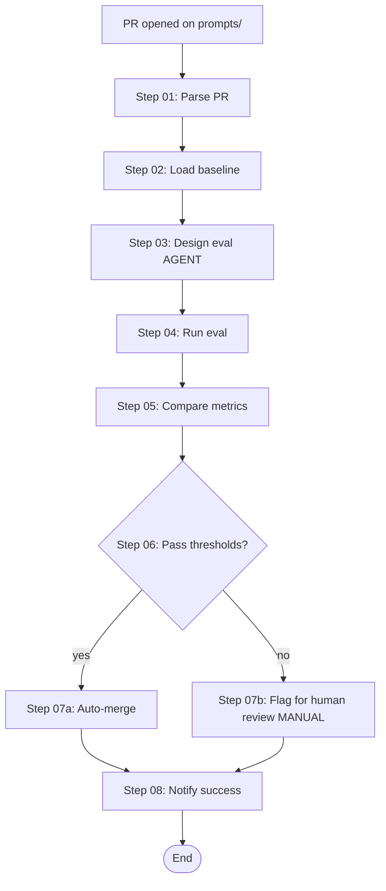

# Esempio end-to-end — target `workflow`

> Output di `B5 workflow-builder-agent`.
> Trasforma il workshop in un **workflow operativo per "prompt review and deployment"**: pipeline CI/CD per prompt in produzione.

## Input

- Sorgente / KG / MKD: `_shared/`
- ASK answers:
  - Trigger: PR opened on prompts/ directory
  - State storage: filesystem JSON per PR
  - Idempotency: ogni step idempotente
  - Step ambigui: "design eval cases" → agent (non script — richiede judgment)
  - Errors: retry 2x con backoff, fallback a notification umana
  - Observability: stdout JSONL + Datadog metrics
  - SLA: pipeline complete <10min per PR
  - Eval scenarios: 4 (happy, regression-caught, edge, timeout)

## Output

```
prompt-review-workflow/
├── flow.md                              # DAG human-readable
├── flow.mermaid                         # diagramma
├── state.md                             # schema state per PR
├── triggers.md                          # GitHub PR trigger spec
├── steps/
│   ├── step-01-parse-pr.md              # type=script
│   ├── step-02-load-baseline.md         # type=script
│   ├── step-03-design-eval.md           # type=agent
│   ├── step-04-run-eval.md              # type=script (parallelo)
│   ├── step-05-compare-metrics.md       # type=script
│   ├── step-06-decision.md              # type=branch
│   ├── step-07a-auto-merge.md           # type=script (branch true)
│   ├── step-07b-flag-for-review.md      # type=manual (branch false)
│   └── step-08-notify.md                # type=script
├── agents/
│   └── eval-designer.md                 # SP per step-03
├── scripts/
│   ├── parse_pr.py
│   ├── load_baseline.py
│   ├── run_eval.py
│   ├── compare_metrics.py
│   ├── auto_merge.py
│   └── notify.py
├── error_handling.md                    # 12 failure mode
├── observability.md                     # log + metric specs
├── runbook.md                           # 8 scenari ops actionable
├── eval_scenarios.json                  # 4 scenari end-to-end
└── README.md
```

## DAG preview



## Step types mix (8 step totali)

| Type | Count | Steps |
|---|---|---|
| script | 6 | 01, 02, 04, 05, 07a, 08 |
| agent | 1 | 03 (eval designer) |
| branch | 1 | 06 (decision point) |
| manual | 1 | 07b (human review) |

## State schema (preview)

```python
state = {
    "pr_id": str,
    "pr_url": str,
    "prompts_changed": list[dict],     # path + old_hash + new_hash per ogni file
    "baseline_metrics": dict | None,    # da step-02
    "eval_cases": list[dict] | None,    # da step-03 (agent)
    "current_metrics": dict | None,     # da step-04
    "comparison": dict | None,          # da step-05 (delta accuracy, cost, latency)
    "decision": str | None,             # "auto-merge" | "human-review"
    "merge_sha": str | None,            # se auto-merged
    "human_reviewer": str | None        # se assegnato per review
}
```

## Stats

- Coverage atomi KG: 85% (parte del workshop è teorica, qui è operativa)
- DAG: 8 nodi, 10 edge, no cycle ✅
- Step manuali: 1 (step-07b con owner: team lead + timeout 4h)
- Failure modes: 12 in error_handling.md
- Runbook scenarios: 8 actionable
- Eval scenarios: 4

## Quando usarlo

- Team con >5 prompt in produzione
- Modifica frequente (≥1 PR/settimana)
- Costo regression matters (cliente API a volume)

## Quando NON usarlo

- Side project / esplorazione
- <3 prompt totali
- No baseline metrics (devi crearli prima)
