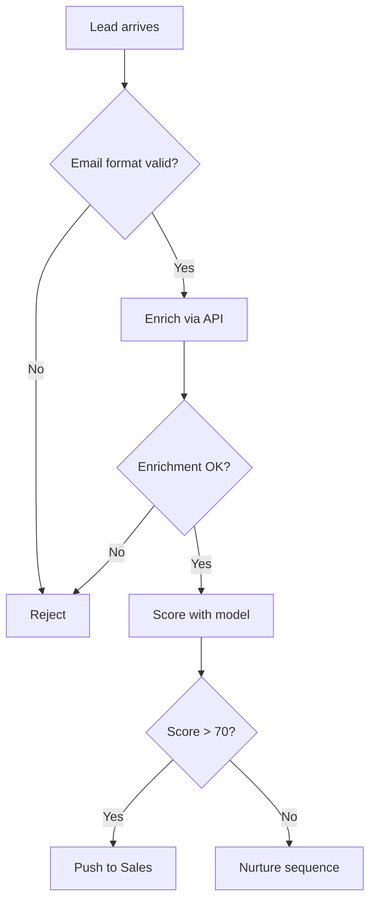

# P7 — Schema / Diagram Generation

> Per ogni concetto strutturato, produce uno **schema visualizzabile** (ASCII art, mermaid, tabella). Aumenta densità informativa e leggibilità senza riassumere.

## Cosa fa

Identifica quando un contenuto è meglio servito da una visualizzazione che da prosa lunga, e genera lo schema appropriato. Non sostituisce la prosa — la **completa**.

## Chi lo applica

- **B1 `doc-builder`** — sezione "Schema" per ogni atomo strutturato.
- **B7 `wiki-builder`** — sezione "Schema" nelle note di tipo `framework` / `procedure`.
- **B4 `skill-builder`** — diagrammi del flusso interno della skill.
- **B5 `workflow-builder`** — `flow.mermaid` per il DAG.
- **B3 `team-builder`** — diagramma della topologia.

## Quando applicarlo

- Sempre per atomi `category: procedure` (flow chart).
- Sempre per `category: framework` con N componenti (component diagram).
- Spesso per `concept` con relazioni (concept map).
- Talvolta per `claim` con argomentazione strutturata (decision tree).

## Quando NON applicarlo

- Per concetti puramente discorsivi senza struttura.
- Quando lo schema richiederebbe semplificazioni che falserebbero il contenuto.
- Quando il sorgente è già illustrato e l'audience target ha la stessa illustrazione (riferisci, non duplicare).

## Tipi di schema e quando usarli

| Tipo | Quando | Tecnologia preferita |
|---|---|---|
| **Flow chart** | Procedura, decisione condizionale | mermaid `flowchart TD` |
| **Concept map** | Relazioni semantiche tra concetti | mermaid `graph LR` o ASCII |
| **State diagram** | Stati e transizioni (workflow, agente) | mermaid `stateDiagram-v2` |
| **Sequence diagram** | Interazioni nel tempo (team, protocollo) | mermaid `sequenceDiagram` |
| **Table** | Confronto attributo×opzione | markdown table |
| **Hierarchy** | Tassonomia, gerarchia | indented list o mermaid `graph TD` |
| **Decision tree** | Scelta tra alternative | mermaid o ASCII tree |
| **Quadrant** | Trade-off su 2 assi | ASCII 2×2 o mermaid quadrant |
| **Timeline** | Sequenza temporale | ASCII timeline |
| **Component diagram** | Architettura | mermaid `graph` o ASCII boxes |

## Esempio: mermaid flow chart

Sorgente (estratto):
> "Per validare un lead: prima check email format; se valida, fai enrichment via API; se enrichment riesce, score con il modello; se score >70 push a sales, altrimenti nurture."

Schema generato:

````markdown

````

## Esempio: tabella di confronto

Sorgente discorsivo su 3 tipi di prompting.

Schema generato:

```markdown
| Tecnica | Esempi richiesti | Quando | Token cost | Tipico use case |
|---------|------------------|--------|------------|-----------------|
| Zero-shot | 0 | Task semplici, ben noti al modello | basso | Classificazione standard |
| Few-shot | 2-5 | Format custom, dominio specifico | medio | Output strutturato custom |
| CoT | 0-5 (con reasoning) | Task multi-step, ragionamento | alto | Math, logica, planning |
```

## Esempio: ASCII concept map

Quando mermaid non è renderizzabile dove va l'output:

```
                    [Prompt Engineering]
                          │
        ┌─────────────────┼─────────────────┐
        │                 │                 │
   [Zero-shot]      [Few-shot]          [CoT]
        │                 │                 │
   nessun esempio    2-5 esempi      reasoning steps
                          │
                  ┌───────┴───────┐
                  │               │
          [Same-domain]    [Cross-domain]
```

## Algoritmo (pseudo)

```python
def generate_schema(atom: dict, kg: dict) -> str | None:
    """Per un atomo, decide se generare schema e di che tipo."""
    schema_type = pick_schema_type(atom)
    if schema_type is None:
        return None  # questo atomo non beneficia di schema

    if schema_type == "flow_chart":
        steps = extract_steps(atom)
        return render_mermaid_flow(steps)
    elif schema_type == "comparison_table":
        items, attributes = extract_comparison(atom)
        return render_md_table(items, attributes)
    elif schema_type == "concept_map":
        nodes, edges = extract_concept_relations(atom, kg)
        return render_mermaid_graph(nodes, edges)
    # ...

def pick_schema_type(atom: dict) -> str | None:
    """Decide il tipo di schema basato sulle caratteristiche dell'atomo."""
    if atom["category"] == "procedure" and has_decisions(atom):
        return "flow_chart"
    if atom["category"] == "procedure" and not has_decisions(atom):
        return "sequence_or_hierarchy"
    if has_comparison_pattern(atom):
        return "comparison_table"
    if atom["category"] == "framework" and has_components(atom):
        return "component_diagram"
    if has_trade_off_axes(atom):
        return "quadrant"
    if has_temporal_sequence(atom):
        return "timeline"
    if has_taxonomy(atom):
        return "hierarchy"
    return None
```

## Convenzioni di rendering

- **Mermaid** preferito quando l'output è markdown e il renderer lo supporta (GitHub, Obsidian, MkDocs, ecc.).
- **ASCII** come fallback (sempre safe, ma meno bello).
- **Markdown table** per confronti attributo×opzione (sempre safe).
- **Mai immagini binarie**: violano portabilità e tracciabilità.

## Etichettatura

Ogni schema generato è etichettato come content proprio di Forge — usa il prefisso `➕` se è completamente generato, o "**Schema (dal sorgente):**" se il sorgente lo aveva già descritto in prosa e Forge lo formalizza.

## Anti-pattern

- **Schema decorativo**: schema che non aggiunge informazione, solo "fa bello". Inutile, rimuovere.
- **Schema che semplifica troppo**: omette caratteristiche importanti del concetto reale → falso/fuorviante.
- **Schema duplicato**: stesso contenuto in prosa + schema senza che lo schema chiarisca nulla di nuovo → ridondanza.
- **Mermaid sintassi rotta**: sempre validare (parse-check) prima di committare lo schema.

## Riferimenti

- Edward Tufte — *The Visual Display of Quantitative Information*
- Mermaid official docs (https://mermaid.js.org/)
