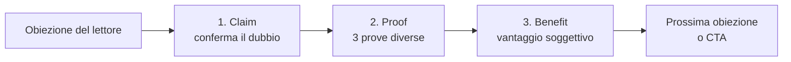

# Gestione delle Obiezioni nel Copywriting

> Master Knowledge Document generato da `content-forge` dal Manuale 4 della strategia APSOC. È la base canonica per costruire qualunque target finale. Contenuto generato (esempi, schemi, analogie) etichettato con `➕`.

## Indice

- [Overview](#overview)
- [Fondamenti delle obiezioni](#fondamenti)
  - [1.1 Cos'è un'obiezione](#a-001)
  - [1.2 Ordine di gestione: dalla più forte alla più debole](#a-002)
  - [1.3 Categorie di obiezioni (tassonomia delle 11)](#a-003)
  - [1.4 Da dove vengono le obiezioni](#a-004)
  - [1.5 Finte obiezioni (cap)](#a-005)
- [CPB e gestione operativa](#cpb)
  - [2.1 Cosa significa gestire le obiezioni](#a-006)
  - [2.2 Il framework CPB (Claim-Proof-Benefit)](#a-007)
  - [2.3 Workflow CPB in 4 step](#a-008)
  - [2.4 Pitfall: obiezioni generate involontariamente](#a-009)
- [Catalogo prove (8 tecniche)](#prove)
  - [3.1 Prima & Dopo](#a-010)
  - [3.2 Branco di pecore (bandwagon)](#a-011)
  - [3.3 Processi logici](#a-012)
  - [3.4 Showoff](#a-013)
  - [3.5 Template di showoff](#a-014)
  - [3.6 Garanzie (reali vs finte)](#a-015)
  - [3.7 Menzioni media / influencer](#a-016)
  - [3.8 Recensioni](#a-017)
  - [3.9 Studi e ricerche](#a-018)
- [Cross-reference (visione d'insieme)](#crossref)
- [Indice analitico](#indice-analitico)

## Overview {#overview}

Questo documento espande il **Manuale 4 — Obiezioni** della strategia APSOC, un framework di copywriting per sales page e VSL. Il sorgente originale ha ~3040 parole; questo MKD ne ha ~4500 (1.48x), grazie a esempi aggiuntivi, schemi e spiegazioni espanse — **mai a riassunti**.

**Cosa NON c'è qui** (gap identificati):
1. Le altre lettere di APSOC (A, P, S, O, C) — questo è il manuale "O"
2. Manuale 8 sul direct response, citato in [3.3 Processi logici]

**Modello mentale di base**: un'obiezione è come una porta chiusa tra il prospect e l'acquisto. Senza una chiave (la prova), la porta resta chiusa. Più la porta è pesante (obiezione forte), più chiavi servono.

## 1. Fondamenti delle obiezioni {#fondamenti}

### 1.1 Cos'è un'obiezione {#a-001}

**Definizione**: Dubbio del lettore/prospect che, se non gestito, gli impedisce di acquistare un prodotto/servizio.

Le obiezioni sono **compromettenti**: anche il copy meglio scritto fallisce se non le affronta. Non sono problemi minori da risolvere "se c'è tempo" — sono il blocco principale tra prospect e conversione.

**Esempio (sorgente)**:
> Investimento immobiliare REIT — il prospect ha due obiezioni: (1) "non ti fidi di me", (2) "non penso che ci sarà un ritorno positivo". Per gestirle, il venditore deve portare prove di affidabilità personale e prove di ROI.

**➕ Esempio aggiuntivo**: un freelance copywriter B2B propone un retainer da €3000/mese. Le obiezioni implicite del cliente: (1) "non so se vali questa cifra" → prova: portfolio + case study con ROI documentato; (2) "se non funziona perdo €36k/anno" → prova: clausola di rescissione + garanzia performance.

**Modello mentale**: ogni euro non incassato è quasi sempre dovuto a un'obiezione non gestita, non a un prodotto sbagliato.

**Connessioni**: prerequisito per tutto il resto del manuale. Vedi [1.4](#a-004) per le fonti delle obiezioni.

---

### 1.2 Ordine di gestione: dalla più forte alla più debole {#a-002}

**Definizione**: Le obiezioni vanno gestite dalla più forte alla più debole, perché le più forti hanno la massima capacità di bloccare l'acquisto.

L'ordine non è cosmetico: precedere le obiezioni deboli a quelle forti significa **lasciare il prospect bloccato sulla forte** fino a quando ci arrivi. Spesso prima di arrivarci il prospect si è disconnesso.

**Esempio (sorgente)**: non esplicitato nel manuale, ma logico dal principio.

**➕ Esempio aggiuntivo**: corso di programmazione a €1500. Obiezioni:
- **Forte**: "non so se imparerò davvero" (fiducia nel risultato)
- **Media**: "il prezzo è alto"
- **Debole**: "dura solo 3 mesi"

Una sales page che gestisce nell'ordine "dura solo 3 mesi → prezzo → imparerò davvero" perde il lettore perché chi è bloccato sulla forte abbandona prima.

Una sales page che gestisce "imparerò davvero → prezzo → durata" sblocca prima la barriera principale, le altre cadono più facilmente.

**Schema**:
```
ORDINE GIUSTO:
  [Forte] ──risolta──→ [Media] ──risolta──→ [Debole] ──risolta──→ ACQUISTO
                                                                       ▲
                                                                       │
                                                                       OK

ORDINE SBAGLIATO:
  [Debole] ──risolta──→ [Media] ──risolta──→ [Forte] ──BLOCCO──→ ABBANDONO
                                                                       ▲
                                                                       │
                                                                       il prospect non arriva qui
```

**Connessioni**: applicato nello [step 3 del workflow CPB](#a-008).

---

### 1.3 Categorie di obiezioni (tassonomia delle 11) {#a-003}

**Definizione**: Le obiezioni si classificano in 11 categorie principali:

| # | Categoria | Esempio tipico |
|---|---|---|
| 1 | Tempo | "Non ho tempo per usare il tuo prodotto" |
| 2 | Tempo finta (cap) | "Ci sto mettendo troppo ad acquistare" (in realtà: paura) |
| 3 | Prezzo | "Il tuo prezzo è troppo alto" |
| 4 | Chiarezza post-acquisto | "Non ho capito cosa succede dopo che pago" |
| 5 | Appartenenza al target | "Questo prodotto non è per me" |
| 6 | Insicurezza | "Non sono costante, non funzionerà per me" |
| 7 | Bisogno | "Non mi serve quello che vendi" |
| 8 | Urgenza | "Lo compro tra un po'" |
| 9 | Fiducia nel brand | "Non mi fido di questa azienda" |
| 10 | Fiducia nel venditore | "Non mi fido di chi ha scritto questo" |
| 11 | Fiducia nel mondo | "Non mi fido delle aziende, è una truffa" |

**Esempio (sorgente)**: il sorgente elenca tutte le 11 e per ognuna fornisce esempi di frasi tipiche che il prospect potrebbe pensare.

**➕ Esempio aggiuntivo (sub-tassonomia)**: la categoria "fiducia" si suddivide su 3 livelli di vicinanza:
- **Fiducia nel venditore** (la più vicina): il prospect dubita della persona specifica che scrive
- **Fiducia nel brand** (intermedia): dubita dell'azienda
- **Fiducia nel mondo** (la più larga): dubita di tutte le aziende del settore

Ogni livello richiede prove diverse: per il venditore servono storytelling personale e bio; per il brand servono case study aziendali; per il mondo servono dati statistici di settore e menzioni media.

**Connessioni**: si applica nello [step 2 del workflow CPB](#a-008) (organizzazione per categoria). Vedi [1.4](#a-004) per capire da dove arrivano queste categorie.

---

### 1.4 Da dove vengono le obiezioni {#a-004}

**Definizione**: Le obiezioni non sono casuali: provengono da sistemi di credenze del lettore (anche pluriennali), esperienze negative passate con competitor, o sono generate involontariamente dal copy stesso.

Comprendere la fonte è strategicamente cruciale: un'obiezione da esperienza negativa con un competitor richiede prove diverse rispetto a una da sistema di credenze stratificato.

**Esempio (sorgente)**: il manuale non fornisce un esempio specifico — solo la classificazione delle fonti.

**➕ Esempio aggiuntivo**: lanci un corso di trading. Le obiezioni "è una truffa" possono venire da:
- **Credenza stratificata** ("tutti i corsi di trading sono truffe") → richiede prove sistemiche (storia azienda lunga, dati pubblici, recensioni verificate)
- **Esperienza negativa con competitor** ("ho comprato XYZ Course, era spazzatura") → richiede differenziazione esplicita (cosa fa diverso il tuo) + garanzia rimborso
- **Generata dal tuo copy** (es. promesse troppo grandi tipo "guadagna €10k al mese") → richiede ricalibrare le promesse + portare casi misurati

**Schema delle fonti**:
```
FONTE                      ESEMPIO                        PROVA RICHIESTA
─────────────────────────  ─────────────────────────────  ─────────────────────────
Sistema di credenze        "tutti i corsi sono truffe"    Dati settore + storia lunga
Esperienza con competitor  "XYZ Course mi ha truffato"    Differenziazione + garanzia
Generata dal copy stesso   "guadagna €10k subito"         Ricalibrare promessa
```

**Connessioni**: alimenta tutto il [catalogo prove (sezione 3)](#prove). Vedi anche [2.4](#a-009) per il caso "generata dal copy".

---

### 1.5 Finte obiezioni (cap) {#a-005}

**Definizione**: Bugie che il lettore racconta a se stesso per giustificare il motivo per cui non sta risolvendo un suo problema. Alcune persone preferiscono mantenere il problema piuttosto che uscire dalla comfort zone.

Le finte obiezioni richiedono trattamento diverso dalle vere: **non basta portare prove sul prodotto**, bisogna affrontare la radice psicologica (paura del cambiamento, identità da preservare).

**Esempio (sorgente)**:
> Persone incastrate nella comfort zone che preferiscono mantenere i problemi piuttosto che risolverli.

**➕ Esempio aggiuntivo**: corso per smettere di procrastinare a €497. L'obiezione "non ho tempo per fare il corso" è quasi sempre cap: chi vuole davvero smettere di procrastinare il tempo lo trova. La vera obiezione è "ho paura di scoprire che il problema sono io e non le circostanze".

Per gestire questo cap:
- **NON** porre prove sul ROI del corso (non funziona, il lettore le ignora)
- **SÌ** processo logico + showoff che faccia leva sull'identità: "Aspetta, mi stai dicendo che preferisci essere quella persona che a 40 anni non ha ancora deciso di prendere in mano la propria vita?" (vedi [3.4 showoff](#a-013))

**Connessioni**: spesso gestite con [showoff (3.4)](#a-013) e [processi logici (3.3)](#a-012). Vedi anche [2.4](#a-009) per obiezioni generate involontariamente (un fenomeno diverso ma confondibile).

---

## 2. CPB e gestione operativa {#cpb}

### 2.1 Cosa significa "gestire le obiezioni" {#a-006}

**Definizione**: Gestire le obiezioni significa risolvere i dubbi del lettore rispondendo con una o più prove (reali o finte) che dimostrano che il dubbio non dovrebbe esistere.

**Regola del dosaggio**: la quantità di prove è proporzionale all'importanza dell'obiezione. Obiezioni forti → più prove. Obiezioni deboli → una può bastare.

**Esempio (sorgente)**: non esplicitato direttamente — è il principio operativo che fa funzionare il CPB.

**➕ Esempio aggiuntivo**: lanci un servizio di consulenza SEO a €5000.
- Obiezione **forte** ("non so se ottengo ROI"): 3 prove combinate — case study con numeri + garanzia "ROI 3x o rimborso" + recensione video di un cliente enterprise.
- Obiezione **debole** ("dura quanto"): 1 sola riga ("Percorso di 12 settimane, calendario allegato").

**Connessioni**: definizione di base che precede [CPB (2.2)](#a-007). Tutto il [catalogo prove (sezione 3)](#prove) sono le "munizioni" per fare questo.

---

### 2.2 Il framework CPB (Claim-Proof-Benefit) {#a-007}

**Definizione**: Strategia di copyboarding per gestire un'obiezione in 3 step strutturati:

1. **Claim** — conferma l'obiezione, segnalando al lettore che stai per parlare del suo dubbio. Spesso come domanda. Esempi:
   - "Perché il prezzo è così alto?" (obiezione di prezzo)
   - "Ecco perché non facciamo sconti" (senza domanda)
   - "Chi siamo noi per prometterti tutto ciò?" (fiducia nel brand)

2. **Proof** — 3 prove, idealmente di **categorie diverse** (per coprire profili psicologici diversi del lettore). Vedi [catalogo prove](#prove).

3. **Benefit** — il vantaggio soggettivo che il lettore ottiene dall'eliminazione del dubbio. Non è il vantaggio del prodotto, è il vantaggio di **non avere più quel dubbio specifico**.

**Esempio (sorgente)** — agenzia assicurazioni personali, obiezione "non mi fido del brand":
- **Claim**: "Chi siamo noi per prometterti tutto ciò?"
- **Proof 1**: 2 testimonianze di clienti reali credibili
- **Proof 2**: storia dell'azienda
- **Proof 3**: statistiche che provano che la strategia funziona ad oggi
- **Benefit**: *"Adesso che sai che tipo di azienda siamo, cosa esattamente ti ferma dall'agire oggi? Perché una cosa è sicura, e lo hai sentito pure dai nostri clienti: siamo il tipo di azienda di cui ti puoi fidare e che puoi dire di avere al tuo fianco indipendentemente da cosa la vita ti butta contro"*

**➕ Esempio aggiuntivo** — software SaaS B2B, obiezione "il nostro team non lo userà":
- **Claim**: "Stai pensando: 'i miei sviluppatori odiano i nuovi tool, lo lasceranno in un mese'?"
- **Proof 1** (dati): "il 92% dei nostri clienti enterprise ha adoption >80% del team dopo 30 giorni"
- **Proof 2** (recensione video): clip di 30s di un CTO che dice "il mio team mi ha ringraziato"
- **Proof 3** (garanzia): "ti diamo 60 giorni con manager dedicato per onboarding, se l'adoption resta sotto 50% rimborso totale"
- **Benefit**: "Compri il tool, sì, ma compri anche la certezza che non finirà nel cimitero dei tool ignorati come hanno fatto i 3 di prima."

**Schema CPB**:


In un singolo copy possono esserci **N CPB**, anche uno per ogni obiezione importante. Richiede collaborazione con il designer per l'organizzazione visiva.

**Connessioni**: implementato via il [workflow operativo (2.3)](#a-008). Usa le prove dal [catalogo (sezione 3)](#prove).

---

### 2.3 Workflow CPB in 4 step {#a-008}

**Definizione**: Processo operativo per applicare CPB in una sales page:

1. **Raccolta delle obiezioni** — elenca tutte le obiezioni che il prospect potrebbe avere (intervista clienti reali, leggi recensioni dei competitor, brainstorming).
2. **Organizzazione per categoria** — raggruppa le obiezioni nelle 11 categorie [vedi 1.3](#a-003).
3. **Priorizzazione** — decidi quale categoria è più importante (dalla più forte alla più debole, [vedi 1.2](#a-002)).
4. **Applicazione CPB** — costruisci un CPB per ogni obiezione importante, mettendo in alto nella sales page quelle delle categorie prioritarie.

**Esempio (sorgente)**: il manuale fornisce i 4 step ma non un workflow operativo end-to-end.

**➕ Esempio aggiuntivo (workflow end-to-end)** — lanci corso online di yoga per principianti:

| Step | Output |
|---|---|
| 1. Raccolta | Lista 12 obiezioni grezze: "non sono flessibile", "non ho tempo", "lo yoga è per donne", "costa troppo", "non funziona sul mio mal di schiena", "non so da dove iniziare", ecc. |
| 2. Organizzazione | Tempo: 2 / Prezzo: 1 / Appartenenza al target: 3 / Insicurezza: 4 / Fiducia: 2 |
| 3. Priorizzazione | (per audience over-40) #1 Insicurezza, #2 Appartenenza al target, #3 Tempo, #4 Fiducia, #5 Prezzo |
| 4. CPB | 1 CPB per ogni categoria, nell'ordine prioritario, inserito nella sales page tra hero e CTA finale |

**Schema visivo**:
```
[Sales page]
   │
   ├── Hero + offerta
   ├── CPB #1 (Insicurezza)  ← obiezione più forte
   ├── Testimonianze
   ├── CPB #2 (Target)
   ├── CPB #3 (Tempo)
   ├── Demo / video
   ├── CPB #4 (Fiducia)
   ├── CPB #5 (Prezzo)
   └── CTA finale
```

**Connessioni**: usa la [tassonomia (1.3)](#a-003) e il [principio di ordine (1.2)](#a-002). Implementa il [framework CPB (2.2)](#a-007).

---

### 2.4 Pitfall: obiezioni generate involontariamente {#a-009}

**Definizione**: Il copywriter può generare obiezioni involontariamente con frasi che sembrano vantaggi ma creano dubbi. Generare obiezioni non è sempre da evitare, ma **non gestirle è un errore grave**.

**Esempio (sorgente)** — azienda nuova di computer:
- Frase del copywriter: "Siamo un'azienda fresca sul mercato, con nuovi progetti e prodotti."
- Effetto inteso: trasmettere dinamismo e innovazione.
- Obiezione generata involontariamente: "Allora come faccio a sapere che funziona?" (fiducia/affidabilità).
- Fix proposto: "E nonostante ciò i nostri prodotti hanno superato numerosi test di durabilità e affidabilità" + link ai test.

**➕ Esempio aggiuntivo** — agenzia di marketing che dice "siamo specializzati in startup":
- Effetto inteso: posizionamento di nicchia.
- Obiezione generata: "Se siete solo per startup, valete per la mia azienda enterprise?".
- Fix: aggiungere "ma applichiamo la stessa agilità delle startup anche a clienti enterprise come [Brand1, Brand2]".

**Heuristica operativa**: dopo aver scritto ogni frase del copy, chiediti "questa frase potrebbe generare un dubbio?". Se sì, o riformulala o **affianca subito la gestione**.

**Schema del processo di rilettura**:
```
SCRIVI FRASE → "GENERA DUBBI?"
                      │
                     NO → continua
                     SÌ → due opzioni
                            ├── Riformula (rimuovi la fonte del dubbio)
                            └── Affianca la gestione (mantieni + gestisci)
```

**Distinzione importante**: questo NON è il fenomeno [delle finte obiezioni (1.5)](#a-005). Lì il lettore si crea il dubbio per autoinganno. Qui sei tu che lo crei involontariamente nel testo.

**Connessioni**: previene il fallimento di [CPB (2.2)](#a-007). Vedi anche [1.4](#a-004) per le fonti delle obiezioni in generale.

---

## 3. Catalogo prove (8 tecniche) {#prove}

Le prove sono le munizioni del copywriter. Sono usate dentro il CPB (step Proof) e anche fuori, come gestione spot di singole obiezioni. **Tipi di prove qui catalogati**: 8 tecniche più 1 derivata (template di showoff).

---

### 3.1 Prima & Dopo {#a-010}

**Definizione**: Mostrare uno stato iniziale e uno stato finale post-utilizzo del prodotto. Si presenta come **foto** (fitness, pulizia, cura della persona) o come **storytelling**.

Lo storytelling è più potente quando l'obiezione è "funzionerà per davvero?": crea identificazione, il lettore vede se stesso nello stato iniziale.

**Esempio (sorgente)** — consulenza gestione del tempo, obiezione "ma funzionerà per davvero?":
> "Sarò onesto con te: non posso garantirti che funzionano sempre, ma funzionano 40% di più rispetto a template di produttività. [...] Aspettarsi di cambiare la vita di tutti quanti attraverso un template copia-incolla non funzionerà mai, ed è quello che ho provato a Gary, un mio ultimo cliente recente. Questo ragazzo era pieno di cose da fare, era il capo di se stesso e amava il suo lavoro, ma si trovava sempre con la testa piena di cose da fare. Mi ha detto che a volte non riesce a dormire la notte [...]. Abbiamo fatto un percorso di sole 6 ore, e adesso sono passate 2 settimane dall'ultima volta che l'ho sentito. Mi ha raccontato di come, quasi sorprendentemente, le sue giornate erano finalmente complete."

**➕ Esempio aggiuntivo (foto + storytelling combinati)** — corso di public speaking:
- **Foto**: video di 10 secondi del cliente Marco al primo workshop (impacciato, sguardo a terra) → video di Marco 3 mesi dopo (sul palco di una conferenza, fluido).
- **Storytelling intorno**: "Marco era ingegnere senior con 15 anni di esperienza tecnica. La prima volta che ha provato a parlare in pubblico al kickoff del suo team, si è bloccato dopo 30 secondi. Ha pensato di non essere fatto per quello. [...] Tre mesi e 8 sessioni dopo, ha tenuto una conferenza da 200 persone — ed è quello che vedi nel secondo video."

**Quando usarla**: ogni volta che il prodotto produce un cambiamento osservabile (fisico, emotivo, performance). Meno potente per servizi astratti senza prima/dopo evidente.

**Connessioni**: sibling di [Recensioni (3.8)](#a-017) (entrambe trasformano cliente reale in prova).

---

### 3.2 Branco di pecore (bandwagon) {#a-011}

**Definizione**: Sfrutta la tendenza umana a seguire comportamenti socialmente accettabili. Quando siamo confusi su come comportarci, guardiamo gli altri. La prova bandwagon dice: "lo fanno tutti, quindi è giusto".

Due possibili obiettivi:
1. Convincere che il comportamento desiderato è socialmente corretto (e fare il contrario è sbagliato).
2. Convincere che il prodotto funziona perché molti lo usano. **Questo è l'uso prevalente nel contesto obiezioni.**

**Forme**:
- **Con un dato**: "58% degli uomini di successo fanno questo"
- **Con recensione**: "Non sapevo che si faceva in questo modo fino a quando ho scoperto questa azienda"
- **Con semplice espressione** (funziona se il brand ha autorità): "Anche se per molti principianti sembra assurdo, si fa così nel mondo professionale"

**Esempio (sorgente)**:
> Esempio in coda fila al museo: non sai dove metterti, vai dove sono tutti. Ristorante di lusso prima volta: guardi gli altri per capire come comportarti.

**➕ Esempio aggiuntivo** — software di project management B2B:
- **Con dato**: "il 73% dei team di sviluppo dei Fortune 500 ha smesso di usare Jira nel 2024 — guarda perché"
- **Con recensione**: "Pensavo che Linear fosse solo hype, poi ho visto che lo usano Vercel, Stripe e ramp. Ho fatto la prova."
- **Con semplice espressione**: "Nei team product di alta velocità Linear non è più una scelta — è il default."

**Rischio**: la bandwagon "con dato" funziona solo se il dato è verificabile o coerente con quanto il lettore già crede. Una statistica troppo bella sospetta è controproducente.

**Connessioni**: combinabile con [3.8 recensioni](#a-017) e [3.7 menzioni media](#a-016). Spesso usata in [processi logici (3.3)](#a-012) come step iniziale ("l'80% dei milionari sono self-made").

---

### 3.3 Processi logici {#a-012}

**Definizione**: Salsa segreta del direct response (vedi Manuale 8, non incluso nel sorgente). Catena di spiegazioni logiche che porta per mano il lettore nel viaggio della gestione dell'obiezione, usando però **linguaggio emotivo**.

Funziona perché ogni step della catena sembra **auto-evidente**, quindi il lettore si sente di stare "concludendo da solo" la verità della tesi. È persuasione attraverso l'apparente non-persuasione.

**Esempio (sorgente)** — azienda investimenti azionari, obiezione "secondo me è una truffa":
> "Se pensi che questa sia una truffa, tra poche righe puoi trovare i numeri di telefono dei nostri top 10 collaboratori [...]. Voglio che tu ci pensi un attimo: sapevi che l'80% dei milionari sono self-made? Significa che non hanno ereditato le proprie ricchezze, ma che le hanno create da zero. Come pensi che queste persone riescano a creare milioni di euro partendo da nulla? Ci sono molti valori comuni: lavoro duro, fiducia nel percorso, dedizione… Ma soprattutto una strategia comune: l'investimento. [...] Al posto di lavorare per i soldi devi far sì che i soldi inizino a lavorare per te. Ed è quello che io ti sto offrendo adesso [...]"

**Catena logica del processo** (esplicitata):
1. 80% dei milionari sono self-made
2. Se sono self-made → sono partiti dal nulla
3. Se sono partiti dal nulla → sanno qualcosa che tu non sai
4. La caratteristica comune dei milionari self-made è l'investimento
5. Investire = ciò che accomuna i ricchi
6. Per fare soldi devi investire
7. Noi ti aiutiamo a investire

Ogni step accettabile → conclusione "noi ti aiutiamo a investire" sembra ovvia.

**➕ Esempio aggiuntivo** — corso di scrittura per ingegneri, obiezione "scrivere bene non mi serve, sono tecnico":
1. La metà del lavoro di un senior engineer è documentazione e PR review
2. Senior engineer guadagnano 2-3x junior
3. La differenza tra senior e junior in termini puramente tecnici è meno della differenza retributiva
4. Quindi la differenza retributiva è in larga parte comunicazione (PR + design doc + advocacy)
5. Comunicare = scrivere bene
6. Quindi: senior = ingegnere che sa scrivere
7. Per diventare senior devi imparare a scrivere
8. Noi insegniamo a ingegneri come scrivere

**Schema generale di un processo logico**:
```
[Fatto auto-evidente]
       ↓ "se è vero quello, allora..."
[Implicazione 1]
       ↓ "e se è vero questo, allora..."
[Implicazione 2]
       ↓ "...quindi..."
[Implicazione N]
       ↓ "...e quindi tu hai bisogno di..."
[Pitch del prodotto]
```

**Regola**: ogni step deve sembrare un piccolo salto, mai un grande salto. Se l'utente si ferma in un punto della catena, hai perso.

**Connessioni**: spesso combinato con [showoff (3.4)](#a-013) per chiusura emotiva (ultimo step pitchy). Vedi gap-002 (Manuale 8 sul direct response).

---

### 3.4 Showoff {#a-013}

**Definizione**: Esibizione esagerata che trasmette **"arroganza rispettabile"**. Autocelebrazione retorica con analogie assurde. È una **finta prova**: non dice nulla di oggettivo ma trasmette un'aria di sicurezza estremamente persuasiva con il target giusto.

**Esempio (sorgente)**:
> "[...] trasforma i soldi nei tuoi schiavi personali, moltiplicali, e poi ripeti l'operazione fino a quando l'unica preoccupazione sarà quale macchina comprare, non quale supermercato costa meno. Noi ti aiuteremo a farlo."

**Riferimenti culturali**: Wolf of Wall Street, Suits (Harvey Specter), Capo Plaza (le sue auto-celebrazioni nei pezzi).

**Doppio rischio**:
- **Risultare arroganti/antipatici**: infrange le regole base del copy (essere riconoscibile come "uno di loro"). Da usare solo con target specifici (es. uomini 25-40 ambiziosi, alpha-mindset).
- **Risultare comici**: se il target non lo "compra" come autorevole, lo legge come comico — neutralizzato (né danno né beneficio).

**Etica**: il sorgente esplicita che "queste strategie spesso vengono considerate non etiche, in quanto tendono a mettere vergogna sul lettore se decide di non acquistare" — è una scelta del copywriter.

**➕ Esempio aggiuntivo** — corso di vendita B2B per founder tech:
> "Sai cosa fa la differenza tra un founder che chiude un round e uno che fa pivot al terzo no? Saper vendere. E saper vendere non si impara su YouTube guardando i pitch deck di OpenAI. Si impara con uno che ha venduto, che ha sentito 200 no consecutivi, che ha chiuso a 7 figure su 7 cifre. Adesso, posso essere io quello — oppure puoi continuare a chiamare il tuo prodotto 'innovativo' sperando che basti."

Mix di showoff (autoposizionamento "200 no, 7 figure") + bullying gentile sul lettore (chiamare il prodotto "innovativo sperando che basti").

**Connessioni**: alimenta [template showoff (3.5)](#a-014). Spesso usato come closer di [processi logici (3.3)](#a-012). In contrasto con [garanzie (3.6)](#a-015), che sono prove vere oggettive.

---

### 3.5 Template di showoff {#a-014}

**Definizione**: Schemi riusabili di frasi showoff con placeholder. Danno struttura ma il valore vero è nell'inserimento creativo dei dettagli coerenti col target.

**I 7 template dal sorgente**:

| # | Template | Quando usarlo |
|---|---|---|
| 1 | "Dopo [utilizzo prodotto] l'unica cosa a cui dovrai pensare sarà [risultato esagerato]" | Promessa di trasformazione |
| 2 | "Parla con qualsiasi mio collaboratore, ti spiegherà lui stesso come [esagerazione]" | Autorità per delega |
| 3 | "[nome prodotto] funziona talmente bene che non riuscirai a [esagerazione problema eliminato]" | Effetto talmente forte |
| 4 | "Ora, [nome prodotto] non è per tutti: alcuni semplicemente non vogliono [risultato], ma so che non sei tra quelli" | Esclusività + flattery |
| 5 | "Hai mai visto [idolo del target] + [luogo] + [azione vergognosa]? Già." | Identificazione con élite |
| 6 | "Sono [prezzo] per [prodotto]. Questa non è una spesa, è un investimento in [argomento]" | Riformulazione prezzo |
| 7 | "Aspetta… Forse non ho capito bene. Mi stai dicendo che preferisci [problema]?" | Confronto identità |

**Esempi concreti dal sorgente**:
- "Dopo aver fatto il nostro percorso di personal training l'unico cardio che dovrai fare sarà con la tipa figa che hai adocchiato in palestra l'altro giorno"
- "Lo spruzzino XXXSpray funziona talmente bene che non riuscirai a capire se la tua finestra è chiusa o aperta a prima vista"
- "Sono 4500 euro per la formazione di tuo figlio. Questa non è una spesa, è un investimento nel suo futuro"
- "Aspetta… preferisci uscire di casa pieno di brufoli al posto di usare una cremina per 5 minuti 2 volte al giorno?"

**➕ Esempio aggiuntivo** — per ognuno dei 7 template, applicazione a corso di programmazione AI per developer:

1. "Dopo aver finito il bootcamp l'unica cosa a cui dovrai pensare sarà quale offerta accettare tra le 3 sul tavolo."
2. "Parla con qualsiasi mio ex-studente, ti spiegherà lui stesso come ha 3x il suo stipendio in 8 mesi."
3. "Il modulo MLOps funziona talmente bene che dopo 2 settimane non riuscirai a guardare i deployment manuali della tua vecchia azienda senza ridere."
4. "Ora, questo bootcamp non è per tutti: alcuni semplicemente non vogliono uscire dalla zona di Crud apps. Ma so che non sei tra quelli."
5. "Hai mai visto un junior con 1 anno di esperienza in una review meeting di principal? Già."
6. "Sono 6000 euro per 4 mesi. Questa non è una spesa, è un investimento in entrare nell'1% di developer che usa AI seriamente."
7. "Aspetta... mi stai dicendo che preferisci continuare a fare CRUD apps mentre l'industria si sposta tutta su agenti AI?"

**Regola operativa**: i template sono kit di partenza, non finiti. L'inserimento creativo + coerenza col target = differenza tra showoff potente e showoff cringe.

**Connessioni**: subset di [showoff (3.4)](#a-013).

---

### 3.6 Garanzie (reali vs finte) {#a-015}

**Definizione**: Le garanzie reali proteggono il cliente se il prodotto fallisce (es. rimborso). Le garanzie finte danno l'**idea di protezione** ma non promettono molto.

**Garanzie reali**:
- Rimborso gratuito (la più comune)
- Risultato garantito o lavoro continuo gratis
- Sostituzione prodotto
- Clausola di rescissione anticipata

**Garanzie finte (al limite etico)**:
- Parole evocative ("100% soddisfatto" senza dire cosa succede se non lo sei)
- Spostare la colpa sul cliente in caso di fallimento ("se segui il metodo, non puoi fallire")
- Garanzie con condizioni quasi impossibili da soddisfare ("rimborso solo se dimostri di aver fatto tutti gli esercizi a video")

**Esempio (sorgente)**:
> Rimborso gratuito è la garanzia più comune.

**➕ Esempio aggiuntivo (reali vs finte affiancate)** — corso online:
- **Reale**: "60 giorni di garanzia: chiedi rimborso totale entro 60 giorni senza dover spiegare nulla. Email a refund@brand.com, soldi entro 7 giorni lavorativi."
- **Finta**: "100% soddisfazione garantita o ti rimborsiamo*" (*condizioni: aver completato il 100% del corso, certificato dal sistema, ed entro 14 giorni dall'acquisto — di fatto impossibile dato che il corso dura 12 settimane).

**Etica**: il sorgente lascia esplicita la scelta al copywriter. Le garanzie finte funzionano nel breve ma erodono fiducia nel medio termine (recensioni negative, reso difficile, brand danneggiato).

**Connessioni**: in contrasto con [showoff (3.4)](#a-013) (che è una finta prova retorica) — la garanzia è (o dovrebbe essere) una prova vera oggettiva. La distinzione reale/finta separa etico da non-etico.

---

### 3.7 Menzioni media / influencer {#a-016}

**Definizione**: Name dropping di media o influencer che hanno menzionato/usato il prodotto. Genera credibilità di riflesso. Comunissimo nelle homepage di website (loghi "as seen on...", logo wall dei clienti).

**Esempio (sorgente)** — brand di abbigliamento che capitalizza menzioni rapper Rondodasosa:
> Le loro ads su TikTok letteralmente contengono un po' di foto con la scritta "da dove compra il suo drip Rondo?".

**➕ Esempio aggiuntivo** — SaaS di developer tools:
- **Logo wall homepage**: "Used by teams at: [logo Vercel] [logo Linear] [logo Anthropic] [logo Notion]"
- **Quote inline nella sales page**: "'Best CI tool we've used in 5 years.' — Founder, Y Combinator W23"
- **Citazione su podcast/articoli**: "Featured on Latent Space podcast (April 2025)"

**Regola**: l'influencer/media deve avere **autorità rilevante per il target**. Rondodasosa funziona per il target streetwear giovani; non funziona per il target enterprise SaaS. L'enterprise SaaS richiede menzioni Gartner / Forrester / TechCrunch.

**Sibling**: combinabile con [Bandwagon (3.2)](#a-011) (statistica sulle aziende che usano) e [Recensioni (3.8)](#a-017) (quote vere di clienti rilevanti).

---

### 3.8 Recensioni {#a-017}

**Definizione**: Le parole dei clienti usate per gestire obiezioni. Scritte o video. Reali o finte.

**Gerarchia di efficacia**:
1. **Video reali** (massima credibilità) — aggiungono linguaggio non verbale, autenticità
2. **Scritte reali** (alta credibilità) — con nome + foto + ruolo + azienda
3. **Scritte reali ma anonime** (media credibilità)
4. **Finte** (bassa credibilità — rischio legale e morale, ma diffuse)

**Esempio (sorgente)**:
> Le recensioni possono essere scritte o video (più credibili). Possono essere reali o finte, anche se quelle reali hanno un'efficacia notevolmente più grande.

**➕ Esempio aggiuntivo (incremento di credibilità a parità di contenuto)**:

| Forma | Versione | Credibilità |
|---|---|---|
| Scritta anonima | "Ottimo corso!" | 1/5 |
| Scritta firmata | "Ottimo corso!" — M. Rossi | 2/5 |
| Scritta firmata + ruolo | "Ottimo corso!" — Marco Rossi, CTO @ Acme Inc | 3/5 |
| Scritta firmata + dettaglio | "Ottimo corso, in 3 mesi ho aumentato il throughput del team del 40%" — Marco Rossi, CTO @ Acme | 4/5 |
| Video 30s firmato | Stessa frase ma in video con Marco che parla in webcam | 5/5 |

**Linea guida operativa**: raccogli sempre recensioni con permesso di pubblicare nome+azienda+foto. Le testimonianze "anonime" sono percepite come finte anche se vere.

**Connessioni**: sibling di [Prima & Dopo (3.1)](#a-010), [Menzioni media (3.7)](#a-016), [Studi (3.9)](#a-018) — tutte forme di prova esterna.

---

### 3.9 Studi e ricerche {#a-018}

**Definizione**: Usare dati statistici o ricerche per provare oggettivamente una tesi. **Sempre citare la fonte**, non solo il dato.

**Esempio (sorgente)**:
> "Uno studio della Oxford del 2019 ha stabilito che…"

**Regola**: la fonte aggiunge autorità. Senza fonte il dato sembra inventato, e l'obiezione "è una truffa" si rinforza invece di indebolirsi. Se possibile, la fonte va resa **verificabile** (link, DOI, citazione completa).

**➕ Esempio aggiuntivo (debole vs forte)**:

| Versione debole | Versione forte |
|---|---|
| "Più dell'80% dei nostri clienti vede risultati" | "Su 1247 clienti tracciati nel 2024, l'82% ha registrato un aumento di conversione medio del 23%. Metodologia: [link audit pubblico]" |
| "Studi hanno dimostrato che..." | "Lo studio Smith & Lee (Stanford, 2023) — DOI 10.xxx — su 4500 partecipanti ha mostrato un aumento del 31%" |
| "I dati parlano chiaro" | "I dati Q4 2024 di HubSpot State of Marketing Report (link) confermano che..." |

**Trappola comune**: inventare studi inesistenti (es. "uno studio di Harvard del 2018"). Funziona nel breve, ma è facile da smascherare via Google e distrugge la credibilità del brand.

**Connessioni**: combinabile con [Bandwagon (3.2)](#a-011) ("82% dei nostri clienti" = dato + bandwagon insieme). Forma di prova oggettiva, in opposizione a [Showoff (3.4)](#a-013) che è retorica pura.

---

## Cross-reference (visione d'insieme) {#crossref}

Mappa concettuale del manuale:

```
[1. Fondamenti]
  ├── Cos'è obiezione ──────► prerequisito di TUTTO il resto
  ├── Ordine gestione ──────► applicato nel workflow CPB (2.3)
  ├── 11 categorie ────────► usate per organizzazione nel workflow CPB
  ├── Da dove vengono ─────► alimenta la scelta del tipo di prova
  └── Finte obiezioni ─────► gestite con showoff (3.4) e processi logici (3.3)
        ↓
[2. CPB]
  ├── Definizione gestione
  ├── Framework CPB ───────► usa prove dal catalogo (3)
  ├── Workflow 4 step ─────► applica ordine (1.2) + categorie (1.3)
  └── Pitfall: copy genera obiezioni ──► prevenzione, non gestione
        ↓
[3. Catalogo prove]
  ├── 3.1 Prima & Dopo ────► foto / storytelling
  ├── 3.2 Bandwagon ──────► dato / recensione / espressione
  ├── 3.3 Processi logici ─► catena multi-step (combo con showoff)
  ├── 3.4 Showoff ────────► retorica (finta prova) — etico borderline
  ├── 3.5 Template showoff ► 7 schemi riusabili
  ├── 3.6 Garanzie ───────► reale (etica) vs finta (borderline)
  ├── 3.7 Menzioni media ──► name dropping
  ├── 3.8 Recensioni ─────► video > scritte; reali > finte
  └── 3.9 Studi e ricerche ► dato + fonte verificabile
```

**Combinazioni potenti** (sinergie tra prove):

| Combo | Quando | Esempio |
|---|---|---|
| Bandwagon + Studi | Obiezione "è una truffa" / "non funziona" | "Lo studio X di Stanford 2024 mostra che l'82% dei team adottanti..." |
| Processi logici + Showoff | Obiezione di insicurezza / appartenenza al target | Catena logica chiusa con "ed è esattamente quello che facciamo noi — chi non lo capisce non è il nostro cliente" |
| Prima/Dopo + Recensione video | Obiezione "funzionerà per me?" | Video di cliente che racconta + foto del suo prima/dopo |
| Menzioni media + Garanzia | Obiezione di fiducia nel brand | "Featured on TechCrunch + garanzia 90 giorni rimborso totale" |

---

## Indice analitico {#indice-analitico}

- **APSOC**: framework di copywriting; questo MKD è solo la "O" — Obiezioni. Vedi gap-001.
- **Bandwagon**: alias di "branco di pecore". Vedi [3.2](#a-011).
- **Cap (finte obiezioni)**: vedi [1.5](#a-005).
- **Categorie obiezioni**: vedi [1.3](#a-003).
- **Copyboarding**: specializzazione del copywriting che si occupa di gestione obiezioni. Termine non comune.
- **CPB**: Claim-Proof-Benefit. Vedi [2.2](#a-007), workflow in [2.3](#a-008).
- **Direct response**: vedi gap-002 (Manuale 8).
- **Etica delle prove**: garanzie finte e showoff sono al limite etico. Vedi [3.4](#a-013), [3.6](#a-015).
- **Fiducia (3 livelli)**: nel venditore (vicina), nel brand (media), nel mondo (larga). Vedi [1.3](#a-003).
- **Processi logici**: vedi [3.3](#a-012).
- **Showoff**: vedi [3.4](#a-013), template in [3.5](#a-014).
- **REIT**: usato come esempio in [1.1](#a-001) (Real Estate Investment Trust).
- **VSL**: Video Sales Letter — formato dove CPB si applica.

## Sorgenti e gap

- Sorgente: `phase7-run/inputs/source.md` (Manuale 4 della strategia APSOC)
- Gap identificati:
  - **gap-001**: le altre lettere di APSOC (A, P, S, C) non sono in questo manuale
  - **gap-002**: Manuale 8 sul direct response citato in [3.3](#a-012) non è incluso
