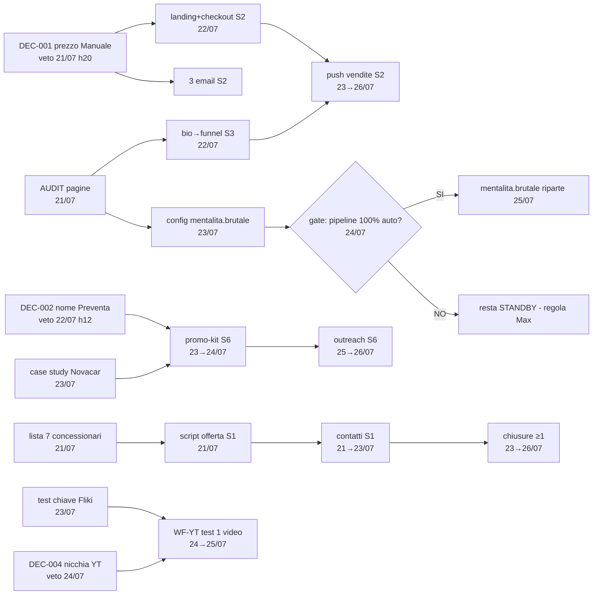

# PLANNING-P3 — Dipendenze, Critical Path & Sequenziamento
> Livello 3 di 7 · migliora P2: trasforma la lista task in un **DAG eseguibile** con date assolute (21→26 luglio 2026), corsie parallele e coda swarm.

## 1. DAG delle dipendenze

## 2. Critical path (revenue)
1. **S1**: lista (21/07) → script (21/07) → contatti (21→23/07) → prima chiusura (23→26/07). *Lunga ma parallela: dipende solo da Max.*
2. **S2**: DEC-001 (21/07 h20) → funnel live (22/07) → push (23→26/07). *Critica: 1 giorno di ritardo su DEC-001 = −1 giorno di vendite.*

Il resto (S3/S4/S5/S6) alimenta entrambe o matura dopo il 26/07.

## 3. Calendario ribasato (date assolute, corsie)

| Data | 🔵 MAX (max 90'/g) | 🟣 GAEL (build) | 🤖 CLAUDE (su comando) |
|------|--------------------|-----------------|------------------------|
| **mar 21/07** | veto/ok DEC-001 (30s) · lista 7 lead (20') · invio primi 2 WA con script | chiudere CF-R8 (30') · **AUDIT pagine** (G-05) · verifica checkout (G-04) | script offerta S1 · batch copy unico serale: landing+3 email+bio |
| **mer 22/07** | contatti 3-4-5 (WA-first) · veto/ok DEC-002 (30s) | **funnel S2 live** (landing+checkout+3 email) · bio→funnel su pagina #1 | supporto copy · aggiorna dashboard EOD |
| **gio 23/07** | contatti 6-7 · follow-up · gestione obiezioni | case study Novacar (Claude esegue) · test chiave Fliki (G-06) · batch 7 caroselli S3 | case study · dashboard |
| **ven 24/07** | chiusure/follow-up · veto/ok DEC-004 | **gate E2E mentalita.brutale** (G-07) · promo-kit S6 (landing rebrand) · code-freeze ore 20:00 | report metriche · checkpoint |
| **sab 25/07** | chiusure · ok promo-kit (10') | se gate S4 ✅ → riparte mentalita.brutale · **WF-YT: 1 video end-to-end** (se chiave ok) | dashboard · fix |
| **dom 26/07** | — | buffer · **RETRO** con numeri veri | RETRO + pattern → ReasoningBank |

## 4. Coda swarm (vincolo 1 Opus alla volta — F-06)

| Priorità | Swarm | Finestra |
|----------|-------|----------|
| 1 | S1 script + closing-prep | 21/07 |
| 2 | S2 funnel copy+CRO | 21/07 sera → 22/07 |
| 3 | S6 promo-kit + case study | 23→24/07 |
| 4 | S5 WF-YT build | 24→25/07 (solo se S1/S2 green) |

## 5. Checklist attivazioni G1 (chiude A-04 di P1)
- [ ] accessi IG pagine + 2FA verificati (da AUDIT) · [ ] account checkout attivo · [ ] chiave Fliki in `.env` testata · [ ] lista 7 lead completa · [ ] Stripe/Gumroad: link pagamento di prova €1

## 6. Diritti di slittamento (anti-overload, R-07)
Ordine di sacrificio se una giornata salta: **S5 → S4 → S6 → S3**. Mai toccare S1/S2 (revenue). Lo slittamento si dichiara con `memory_manager.py error --wf WF-Sn --note "slitta a settimana prox"`.

---
⛓️ Trace P12: `PLANNING-P3#estate-2026` · input: P2 · vincoli: F-05, F-06, F-07
