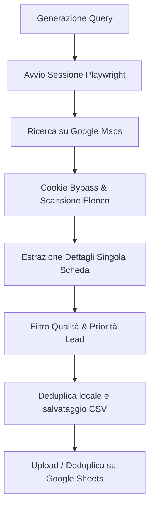

# Flusso di Estrazione Preventa Maps Scraper

Questo documento descrive il processo end-to-end eseguito dal motore di scraping dei concessionari.

## Fasi del Flusso

1. **Generazione Query**: Costruisce la stringa di ricerca basata sulla categoria (es. `concessionario auto`) e la città fornita.
2. **Sessione Playwright**: Inizializza un'istanza Chromiumheaded o headless simulando un browser reale (viewport, user-agent, lingua `it-IT`).
3. **Cookie Bypass**: Cerca e clicca sui pulsanti dei banner di consenso cookie se presenti.
4. **Scansione Elenco**: Carica e scrolla l'elenco dei risultati fino a raggiungere il limite configurato o la fine dei risultati.
5. **Estrazione**: Clicca su ciascun concessionario ed estrae Nome, Indirizzo, Telefono, Sito Web, Rating e Numero di Recensioni.
6. **Filtro Qualità (checker)**: Effettua richieste HTTP al sito del concessionario per analizzare:
   - Se ha o meno un sito web.
   - Presenza di tracciamenti (Facebook Pixel, Google Tag Manager).
   - Se il sito è datato/incompleto.
7. **Calcolo Priorità**: Assegna priorità:
   - **ALTA**: se non ha sito web, se il sito è obsoleto o ha meno di 10 recensioni.
   - **MEDIA**: se ha il sito ma non ha pixel/GTM (no campagne attive).
   - **BASSA**: se ha sito moderno con tracciamenti e molte recensioni.
8. **Deduplica & Salvataggio**:
   - Salva i dati in locale in formato CSV (ordinati per priorità). Se `--only-alta` è attivo, salva anche un file dedicato `_SOLO_ALTA.csv`.
9. **Google Sheets Sync**: Se abilitato, esegue l'upload a batch deduplicando per numero di telefono normalizzato.
