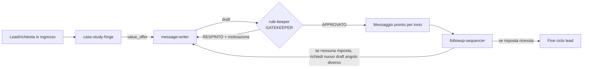
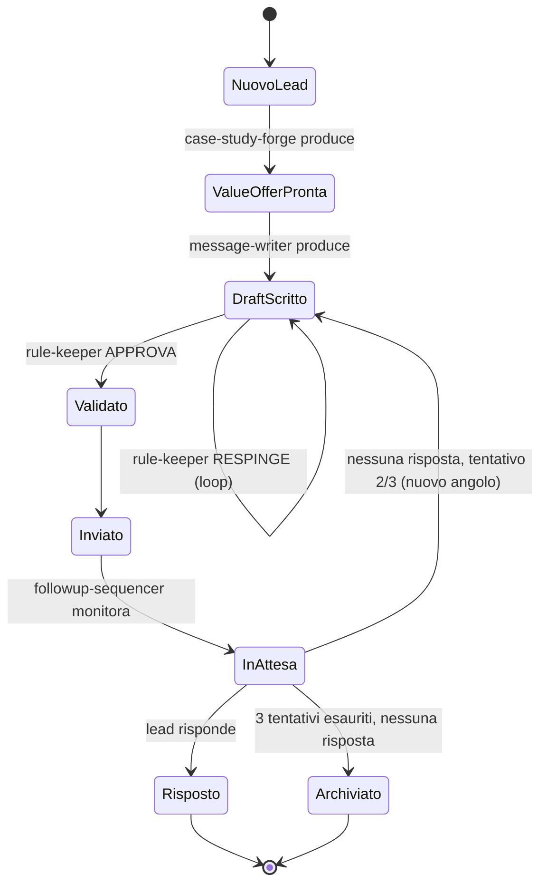

# Topologia — Outreach Message Team

## Topologia scelta: Gatekeeper + Pipeline

Non una topologia pura del catalogo standard, ma una combinazione motivata dal vincolo
esplicito di Max: **le regole della Bibbia (`bibbia-messaggi-outreach.md`) non sono derogabili**. Questo
richiede un punto di applicazione centrale (gatekeeper) che nessun messaggio può
bypassare, combinato con una pipeline lineare per la produzione del contenuto.

## Perché questa topologia e non altre

**Scartata: Peer-to-peer.** Il compito non è creativo/di brainstorming, è
produzione+validazione con un gate non negoziabile — il p2p non garantisce che TUTTI i
messaggi passino dal controllo regole.

**Scartata: Hub-spoke puro.** Non c'è dispatching su input eterogenei da smistare a
specialisti diversi — c'è una sequenza fissa di trasformazioni (dati lead → value offer →
messaggio → validazione → invio → follow-up).

**Scelta: Pipeline (case-study-forge → message-writer) + Gatekeeper obbligatorio
(rule-keeper) + loop di follow-up (followup-sequencer che rientra nella pipeline).**
Questo garantisce che:
1. Ogni messaggio abbia SEMPRE un'offerta di valore concreta prima di essere scritto
   (case-study-forge non è opzionale, è il primo step).
2. Nessun messaggio esca senza passare dal controllo dei 5 pilastri (rule-keeper come
   gate architetturale, non come suggerimento).
3. Il ciclo di vita di un lead non si fermi al primo messaggio: followup-sequencer è
   responsabile di far rientrare lo stesso lead nella pipeline con un angolo diverso,
   fino a un massimo di 3 tentativi totali.

## Ruolo del rule-keeper: Gatekeeper, non solo Coordinator classico

In un supervisor pattern classico, il coordinator pianifica e delega. Qui `rule-keeper`
fa anche da coordinator (vede tutti i ruoli, instrada gli handoff) MA la sua funzione
primaria e non negoziabile è il **veto**: può bloccare qualunque messaggio, in qualunque
punto della pipeline, se viola anche un solo pilastro della Bibbia. Questo è
intenzionale — vedi `coordinator.md` per il dettaglio del suo mandato.

## Diagramma di stato di un lead nel ciclo

