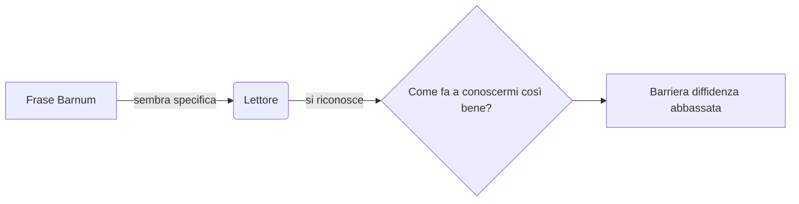
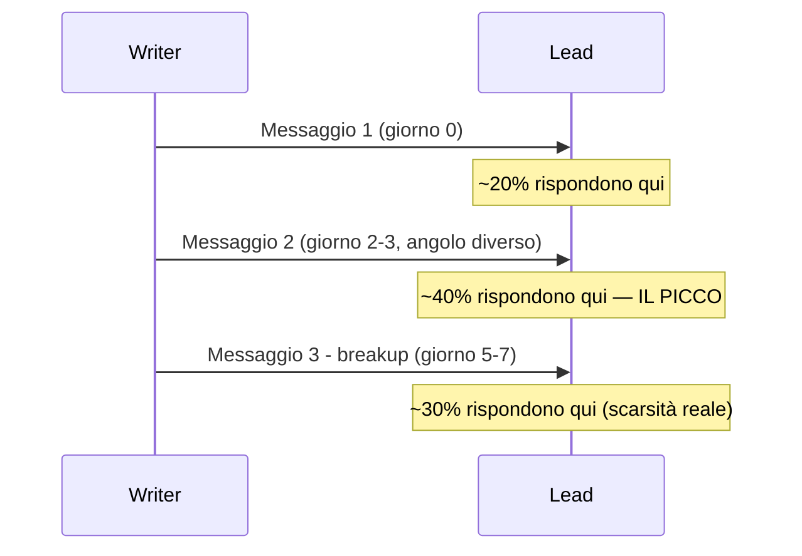
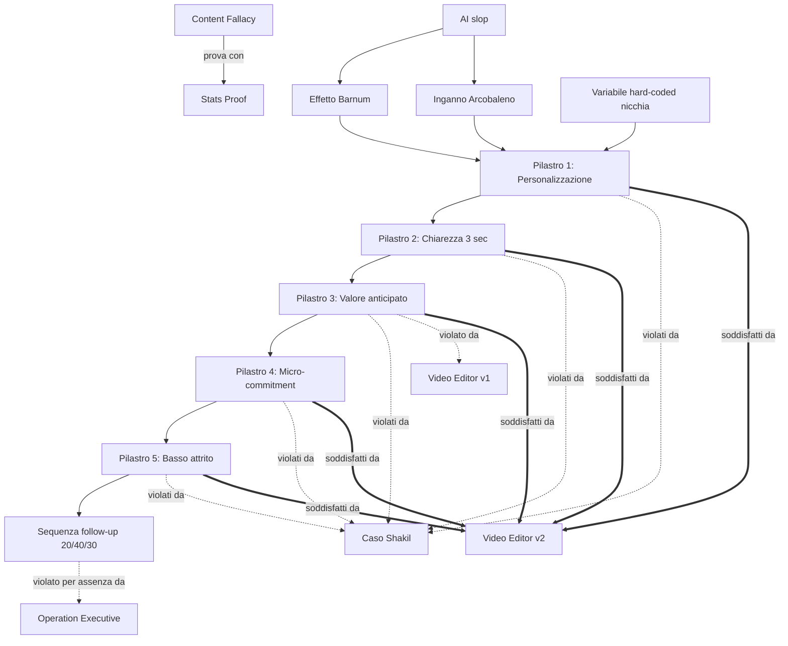

# Master Knowledge Document — La Bibbia dei Messaggi

## Overview

Questo documento è la versione canonica, consolidata e ampliata del framework di cold
outreach descritto da Max nella fonte (trascrizione di un suo video + due rielaborazioni
editoriali dello stesso contenuto). Le tre passate nel sorgente ripetono, con parole
diverse, lo stesso corpo di regole — questo MKD le fonde in un'unica versione senza
perdere nessuna informazione, segnalando dove il sorgente insiste di più (ripetizione =
enfasi voluta dall'autore, non rumore da tagliare).

**Per esplicita istruzione di Max, questo documento È la "Bibbia dei messaggi": ogni
agente del team costruito da questa fonte (vedi `stage-06/output/outreach-message-team/`)
deve rispettare queste regole senza eccezioni. Nessun messaggio di cold outreach —
LinkedIn DM, WhatsApp, email — esce dal team se viola un pilastro qui descritto.**

Il documento copre 16 atomi in 6 cluster:
- **A. Il Paradigma** — perché il cold outreach batte il content passivo
- **B. Le due leve psicologiche** — Effetto Barnum e Inganno Arcobaleno
- **C. I 5 Pilastri** — il cuore operativo del framework
- **D. Tecnica operativa** — la variabile hard-coded di nicchia
- **E. Casi studio comparativi** — 4 esempi reali analizzati riga per riga
- **F. Sequenza di follow-up** — dove sono davvero i soldi

## Indice

1. [Cluster A — Il Paradigma](#cluster-a)
2. [Cluster B — Le due leve psicologiche](#cluster-b)
3. [Cluster C — I 5 Pilastri del Cold DM](#cluster-c)
4. [Cluster D — Variabile hard-coded di nicchia](#cluster-d)
5. [Cluster E — Casi studio comparativi](#cluster-e)
6. [Cluster F — Sequenza di follow-up](#cluster-f)
7. [Cross-reference](#cross-ref)
8. [Indice analitico / checklist di validazione](#indice-analitico)

---

## Cluster A — Il Paradigma: perché il Cold Outreach batte il Content {#cluster-a}

### La Content Fallacy {#atom-content-fallacy}

**Definizione**: la Content Fallacy è la convinzione diffusa (e sbagliata, nel breve
termine) che pubblicare contenuti sui social media basti da solo a generare un flusso
costante di clienti.

**Spiegazione estesa**: il sorgente è categorico su questo punto e lo ripete in tutte e
tre le passate: postare contenuti costruisce autorità e brand nel lungo periodo (specie
su piattaforme "durevoli" come YouTube, dove i video restano cercabili), ma NON è il
motore diretto delle entrate a breve termine per un'agenzia o un freelancer. La narrativa
dominante — "posta e i clienti arrivano" — è descritta esplicitamente come "una favola
per dilettanti". Il vero lavoro che genera clienti è quello che non si vede: l'outreach
attivo, non il post pubblico.

Questo non significa "non fare contenuti" — significa non delegare l'acquisizione clienti
al content da solo, soprattutto quando serve fatturato adesso, non tra 12 mesi.

**Esempio (sorgente)**:
> "meno del 5% delle mie entrate è derivato direttamente dai post pubblicati [...] Il
> vero motore di questa conversione non è il post virale. È il 'lavoro sporco' che
> avviene dietro le quinte."

**➕ Esempio aggiuntivo**: un'agenzia CRO pubblica un post LinkedIn con 50.000
visualizzazioni e riceve 3 messaggi spontanei — ma quel giorno lo stesso founder manda 20
DM mirati a titolari di CRM aziendali e riceve 4 risposte con 1 call fissata: il post ha
costruito percezione, il DM ha costruito la pipeline.

**Schema**:
```
Post pubblico (inbound)          Outreach attivo (outbound)
────────────────────             ──────────────────────────
Costruisce autorità nel tempo    Genera pipeline ORA
Passivo, aspetta che ti notino   Proattivo, tu scegli il target
< 5% delle entrate reali         > 95% del "lavoro sporco" che converte
```

**Connessioni**:
- Correlato: [Le prove numeriche del creator](#atom-stats-proof)

---

### Le prove numeriche del creator {#atom-stats-proof}

**Definizione**: il set di dati concreti che l'autore usa per rendere falsificabile (non
un'opinione) l'affermazione della Content Fallacy.

**Spiegazione estesa**: oltre 50.000 follower guadagnati in un anno su LinkedIn, circa
$100.000 generati, posizionamento #1 come creator nel settore IT/Tech in Lussemburgo e
#3 assoluto per crescita su LinkedIn (dati Favicon, piattaforma di classifiche, terzo
dietro al Primo Ministro del paese). Nonostante questi numeri da "content creator di
successo", **meno del 5%** delle entrate reali viene dai post. Il volume di lavoro
manuale dietro le quinte: **circa 600 commenti/settimana** lasciati da un team dedicato e
**circa 100 DM/settimana** mandati personalmente. A riprova della domanda generata (non
dal content, ma dal posizionamento + outreach combinati): 157 richieste ricevute in un
mese per il proprio coaching program, al punto da valutare di chiuderlo per eccesso di
domanda.

**Esempio (sorgente)**:
> "ho ricevuto 157 richieste per il mio coaching program motivo per cui sto anche
> valutando di chiuderlo"

**➕ Esempio aggiuntivo**: se un'agenzia italiana replicasse lo stesso rapporto (600
commenti + 100 DM/settimana), con un reply rate anche solo del 20% sul primo messaggio
(vedi [Sequenza follow-up](#atom-followup-3-step-rates)) otterrebbe ~20 conversazioni
aperte a settimana, ~80/mese — un volume che nessun post virale isolato garantisce con
la stessa costanza.

**Connessioni**:
- Richiede: [La Content Fallacy](#atom-content-fallacy)

---

## Cluster B — Le due leve psicologiche di personalizzazione {#cluster-b}

### AI slop: il filtro spam del cervello {#atom-ai-slop-problem}

**Definizione**: "AI slop" è il termine usato nel sorgente per i messaggi generati da AI
in modo pigro e generico (es. "Ciao {{nome}}, ho visto il tuo profilo, [icebreaker
generato liberamente dall'AI]") — messaggi che il cervello umano ha imparato a
riconoscere e scartare in meno di un secondo.

**Spiegazione estesa**: il punto centrale, ripetuto in tutte e tre le passate del
sorgente, è che la personalizzazione **non è la stessa cosa di** "lasciare che l'AI
scriva un icebreaker libero" con solo il nome come variabile. Quel tipo di
personalizzazione superficiale produce un "mappazzone" riconoscibile a colpo d'occhio.
La vera personalizzazione richiede due tecniche psicologiche specifiche (Barnum e
Rainbow, sotto) che producono frasi **generali ma percepite come specifiche** — l'esatto
opposto dell'AI slop, che è specifico nella forma (nome, dettaglio a caso) ma generico
nella sostanza psicologica.

**Esempio (sorgente)**:
> "se lasciamo l'AI libera di fare queste icebreaker viene fuori un mappazzone o come lo
> chiamiamo noi un AI slop"

**➕ Esempio aggiuntivo**: "Ciao Marco, ho visto il tuo profilo, complimenti per il
percorso!" è AI slop (variabile = solo il nome, il resto è vuoto universale che non
prova nulla). "Hai una grande necessità di piacere agli altri ma tendi a essere molto
critico con te stesso" è Effetto Barnum: sembra specifico, è universale, ma **funziona**
perché il cervello del lettore non lo riconosce come template.

**Connessioni**:
- Correlato: [Effetto Barnum](#atom-barnum-effect)
- Correlato: [Inganno Arcobaleno](#atom-rainbow-effect)
- Correlato: [Pilastro 1 — Personalizzazione reale](#atom-pillar-1-personalizzazione)

---

### Effetto Barnum (Forer) {#atom-barnum-effect}

**Definizione**: tecnica psicologica che consiste nell'usare una **frase universale
specifica** — un'affermazione applicabile a quasi chiunque, ma formulata in modo che
sembri un'osservazione intima e personale.

**Spiegazione estesa**: il nome viene dall'effetto Forer/Barnum, lo stesso principio che
spiega perché gli oroscopi funzionano: sono scritti per essere vagamente veri per
chiunque li legga, ma percepiti come "scritti apposta per me". Il sorgente lo applica al
cold outreach: se una frase Barnum si applica al 99% delle persone di una nicchia (es.
imprenditori), lasciare fuori l'1% a cui non si applica non è un fallimento — è
**esattamente il costo accettabile** di un messaggio scalabile che sembra su misura per
il 99% restante. L'autore lo dice esplicitamente: ottimizzare per "generalmente
applicabile ma percepito come specifico" batte "vero al 100% ma generico e
riconoscibile".

**Esempio (sorgente)**:
> "Hai una grande necessità di piacere agli altri ma tendi a essere molto critico con te
> stesso [...] se uno si ferma e pensa a questa frase dice 'Ah mannaggia però mi
> conosce'"

**➕ Esempio aggiuntivo (adattato a un concessionario auto import, dominio Preventa)**:
"Immagino che gestire prezzi e traduzioni sugli annunci esteri richieda più attenzione di
quanto sembri da fuori" — vero per quasi ogni concessionario import, percepito come
un'osservazione su misura.

**Schema**:


**Connessioni**:
- Richiede: [AI slop](#atom-ai-slop-problem)
- Correlato: [Inganno Arcobaleno](#atom-rainbow-effect)
- Implementa: [Pilastro 1 — Personalizzazione reale](#atom-pillar-1-personalizzazione)

---

### Inganno Arcobaleno (Rainbow Effect) {#atom-rainbow-effect}

**Definizione**: tecnica che attribuisce a una persona un tratto della personalità **e,
nella stessa frase, il suo esatto opposto** — coprendo così sia chi si riconosce nel
primo tratto sia chi si riconosce nel secondo.

**Spiegazione estesa**: dove l'Effetto Barnum usa un'affermazione singola abbastanza
vaga da applicarsi a tutti, l'Inganno Arcobaleno copre l'intero spettro dichiarando
ENTRAMBI i poli di un tratto ("socievole MA a volte riservato"). Poiché quasi nessun
essere umano è monolitico su un tratto di personalità (tutti hanno momenti diversi), la
frase risulta vera per il 99% delle persone secondo il sorgente. È particolarmente
efficace su imprenditori/creator: persone spesso proiettate verso l'esterno per dovere
professionale ma con una vita privata più riservata — il contrasto pubblico/privato è
quasi universale in quella popolazione.

**Esempio (sorgente)**:
> "Di solito sei una persona socievole ed aperta ma ci sono momenti in cui ti chiudi in
> te stessa e diventi molto riservata"

**➕ Esempio aggiuntivo**: "Di solito sei molto organizzato con i clienti, ma quando si
tratta della tua stessa attività finisci sempre per rimandare le cose amministrative" —
applicabile a quasi ogni piccolo imprenditore.

**Connessioni**:
- Richiede: [AI slop](#atom-ai-slop-problem)
- Correlato: [Effetto Barnum](#atom-barnum-effect)
- Implementa: [Pilastro 1 — Personalizzazione reale](#atom-pillar-1-personalizzazione)

---

## Cluster C — I 5 Pilastri del Cold DM ad Alta Conversione {#cluster-c}

> Un messaggio di cold outreach non è una proposta di matrimonio: è l'apertura di un
> dialogo. Questi 5 pilastri sono **tutti obbligatori insieme** — il sorgente mostra
> ripetutamente che un messaggio con 4/5 pilastri corretti ma 1 mancante (tipicamente
> "chiedere qualcosa senza aver dato nulla") fallisce comunque (vedi Cluster E).

### Pilastro 1 — Personalizzazione reale {#atom-pillar-1-personalizzazione}

**Definizione**: il messaggio deve contenere un elemento che il destinatario percepisce
come specifico per sé, ottenuto tramite Effetto Barnum, Inganno Arcobaleno, o una
variabile di nicchia reale (mai un placeholder vuoto tipo "Ciao {{nome}}" da solo).

**Spiegazione estesa**: dimentica i placeholder standard. La personalizzazione vive nella
comprensione dei problemi della nicchia (es. calo di reach organica per i creator,
difficoltà di recruiting per il tech, traduzione di annunci esteri per un import auto) —
non nel nome del destinatario.

**Esempio (sorgente)**: vedi [Effetto Barnum](#atom-barnum-effect) e [Inganno
Arcobaleno](#atom-rainbow-effect).

**➕ Esempio aggiuntivo**: si veda [Variabile hard-coded di nicchia](#atom-niche-variable-hardcoded-technique)
per il metodo pratico di scalare la personalizzazione senza scriverla a mano per ogni
lead.

**Connessioni**:
- Richiede: [Effetto Barnum](#atom-barnum-effect), [Inganno Arcobaleno](#atom-rainbow-effect)
- Violato da: [Caso Shakil](#atom-case-shakil)
- Soddisfatto da: [Caso Video Editor v2](#atom-case-video-editor-good)

---

### Pilastro 2 — Chiarezza d'intenti (regola dei 3 secondi) {#atom-pillar-2-chiarezza-3sec}

**Definizione**: entro i primi 3 secondi (circa la prima riga e mezza su mobile/LinkedIn)
il destinatario deve capire CHI sei e PERCHÉ lo stai contattando. Se deve sforzarsi per
capirlo, hai già perso.

**Spiegazione estesa**: il sorgente descrive l'attenzione di chi riceve un cold DM come
una curva che crolla bruscamente dopo pochi secondi ("il secondo 3... il secondo 4... e
dopo fa così" — gesto di crollo). Non basta essere chiari "da qualche parte nel
messaggio": bisogna esserlo nella primissima porzione visibile, perché su LinkedIn/mobile
il destinatario vede solo i primi ~100 caratteri prima di decidere se aprire.

**Esempio (sorgente)**:
> "l'attenzione [...] nel cold email o cold DMs fa questo fino ai 3 secondi e dopo fa
> così [crolla]"

**➕ Esempio aggiuntivo**: "Ciao [Nome], ho visto il tuo ultimo video su [tema]: finalmente
qualcuno che ne parla senza fronzoli" comunica chi (uno che segue quel contenuto) e
perché (ha un'opinione/aggancio reale) entro la prima riga — non serve leggere oltre per
capire il contesto.

**Connessioni**:
- Violato da: [Caso Shakil](#atom-case-shakil)
- Soddisfatto da: [Caso Video Editor v2](#atom-case-video-editor-good)

---

### Pilastro 3 — Valore anticipato & Artificial Case Study {#atom-pillar-3-valore-anticipato}

**Definizione**: prima di chiedere qualunque cosa (tempo, soldi, una call), devi dare
qualcosa di gratuito e concreto. Se non hai ancora case study/autorità dimostrabile, devi
**crearne uno artificialmente** prima del contatto, non raccontarlo a parole.

**Spiegazione estesa**: questo è il pilastro su cui il sorgente insiste di più, con la
frase più diretta di tutto il materiale: "nessuno è speciale" quando si entra
nell'imprenditoria — la tua professionalità pregressa (anche 10 anni in un'azienda nota)
**vale zero** per uno sconosciuto finché non risolve un SUO problema specifico oggi.
L'unica moneta di scambio credibile con un estraneo sono i case study — se non li hai,
il sorgente prescrive di **crearli artificialmente**: prendi un contenuto/materiale reale
del lead (un video, un annuncio, un progetto) e produci gratuitamente un pezzo di lavoro
finito PRIMA di chiedere un centesimo (es. monta l'hook del prossimo video, traduci un
annuncio, genera un preventivo di esempio). Questo si chiama "ego-killing": accettare di
lavorare gratis all'inizio per dimostrare, non dichiarare, che sai risolvere il problema.

**Esempio (sorgente)**:
> "la vostra professionalità vale ma non ha alcun valore [...] quando non è in target con
> quello che state vendendo [...] l'unica vostra moneta qui sono i case study"

**➕ Esempio aggiuntivo (dominio Preventa)**: invece di scrivere "abbiamo un software di
preventivi ottimo", si genera un PDF preventivo di esempio usando un vero annuncio auto
pubblico del concessionario target, e lo si allega/descrive nel messaggio — il
destinatario vede il lavoro finito prima di impegnarsi a rispondere.

**Schema**:
```
SENZA case study reale → NON dire "sono bravo" → CREA un case study artificiale
                                                  (lavoro gratuito mirato al lead specifico)
                                                  → poi chiedi un micro-commitment
```

**Connessioni**:
- Precede: [Sequenza di follow-up](#atom-followup-3-step-rates)
- Violato da: [Caso Video Editor v1](#atom-case-video-editor-bad), [Caso Shakil](#atom-case-shakil)
- Soddisfatto da: [Caso Video Editor v2](#atom-case-video-editor-good)

---

### Pilastro 4 — Micro-commitment {#atom-pillar-4-microcommitment}

**Definizione**: non chiedere mai un impegno grande (una call di 30-60 minuti) al primo
messaggio. Chiedi un impegno minimo, quasi nullo — un "sì" piccolo che apre la porta a
richieste successive più grandi.

**Spiegazione estesa**: il principio psicologico citato ("1000 studi") è che una volta
ottenuto un primo "sì", anche minuscolo, diventa più facile ottenere i "sì" successivi.
L'errore da evitare è chiedere subito una call: nel B2B impiegatizio "saltiamo in call" è
normale, ma con un imprenditore/creator occupato (il sorgente cita 157 richieste di
coaching in un mese come prova del sovraccarico di questi profili) è già troppo. Il
micro-commitment tipico nel sorgente: "mandami un link Google Drive" — un'azione da
pochi secondi, non un impegno di calendario.

**Esempio (sorgente)**:
> "non chiedere mai una call di 30 minuti al primo messaggio [...] chiedi un impegno
> minimo, quasi nullo, come il permesso di inviare un link Drive"

**➕ Esempio aggiuntivo**: "Se ti va, mandami un WhatsApp con il link dell'annuncio e ti
preparo io il PDF di esempio" — micro-commitment: mandare un link, non fissare una call.

**Connessioni**:
- Violato da: [Caso Video Editor v1](#atom-case-video-editor-bad)
- Soddisfatto da: [Caso Video Editor v2](#atom-case-video-editor-good)

---

### Pilastro 5 — Basso attrito {#atom-pillar-5-basso-attrito}

**Definizione**: l'azione richiesta al destinatario deve essere completabile in pochi
secondi, con zero decisioni complesse da prendere.

**Spiegazione estesa**: basso attrito è distinto dal micro-commitment (pilastro 4): il
micro-commitment riguarda QUANTO chiedi, il basso attrito riguarda QUANTO È FACILE farlo.
Il gold standard citato dal sorgente è "mandami un link Google Drive" — non richiede
decisioni, non richiede di capire un processo, non richiede di scaricare nulla di
complesso. Un messaggio può avere un ottimo micro-commitment ma alto attrito se, per
esempio, chiede di compilare un form con 10 campi.

**Esempio (sorgente)**:
> "l'azione richiesta deve essere indolore [...] Un semplice link Google Drive"

**➕ Esempio aggiuntivo**: "Rispondimi solo con 'sì' se vuoi vederlo" ha attrito quasi
zero — una parola, nessuna decisione da prendere su come/dove/cosa mandare.

**Connessioni**:
- Violato da: [Caso Shakil](#atom-case-shakil) (chiede di aprire un link e impiegare tempo, senza aver dato nulla)
- Soddisfatto da: [Caso Video Editor v2](#atom-case-video-editor-good)

---

## Cluster D — Variabile hard-coded di nicchia {#cluster-d}

### Variabile hard-coded di nicchia {#atom-niche-variable-hardcoded-technique}

**Definizione**: tecnica per scalare la personalizzazione senza scrivere ogni messaggio a
mano: invece di lasciare che l'AI generi liberamente un riferimento (rischio AI slop),
si inserisce un termine tecnico specifico della nicchia, deciso a monte da chi scrive la
campagna (es. "Cloud Code" per chi parla di AI, "Watchtime/CTR" per i video creator,
"import Germania" per i concessionari auto import) — identico per tutti i lead della
stessa nicchia, ma percepito come frutto di una ricerca individuale.

**Spiegazione estesa**: il sorgente distingue esplicitamente questa tecnica dal
"personalizzare con AI libera": qui la variabile non è generata dall'AI per ogni singolo
lead, è **decisa una volta per l'intera nicchia** (anche via scraping semplice del
linguaggio dominante in quel settore) e poi applicata in blocco. È lo stesso principio
dell'Effetto Barnum applicato al linguaggio tecnico invece che ai tratti di personalità:
una frase che sembra "ho fatto la ricerca su di te" ma è in realtà "ho fatto la ricerca
sulla tua nicchia una volta sola".

**Esempio (sorgente)**:
> "la variabile che voi cercate con AI [...] scegli tra cloud code antigravity o gli date
> due tre variabili oppure semplicemente questa parte qui la fate hard coded"

**➕ Esempio aggiuntivo (dominio Preventa, coerente con `personalizza_messaggi.py` già in
uso in questo repo)**: il Gancio 4 "Import/annunci esteri" usa la stessa identica
logica — la frase "gli annunci esteri (tedeschi, ecc.) richiedono doppio lavoro tra
traduzione e calcoli" è hard-coded per TUTTI i concessionari import, non generata ad-hoc
per ognuno, eppure ognuno la legge come se fosse stata scritta pensando a lui.

**Connessioni**:
- Implementa: [Pilastro 1 — Personalizzazione reale](#atom-pillar-1-personalizzazione)
- Usato da: [Caso Video Editor v2](#atom-case-video-editor-good)

---

## Cluster E — Casi studio comparativi {#cluster-e}

> Il sorgente analizza 4 messaggi reali ricevuti dall'autore, valutandoli riga per riga
> contro i 5 pilastri. Questa è la parte "da manuale operativo": ogni agente writer/critic
> del team deve saper riprodurre questo stesso esercizio di valutazione su QUALSIASI
> bozza di messaggio.

### Caso Shakil (Full Stack Developer) — fallimento totale {#atom-case-shakil}

**Definizione**: primo esempio analizzato, un messaggio LinkedIn ricevuto dall'autore, che
viola 4 pilastri su 5.

**Spiegazione estesa**: testo originale — "ciao sono Shakil ho speso un sacco di tempo
lavorando a web Product e risolvendo problemi per i team, questo è il mio lavoro [link]".
Valutazione pilastro per pilastro dal sorgente:
- Personalizzazione: **NO** — nessun nome del destinatario, zero riferimento specifico.
- Chiarezza 3 secondi: **NO** — non è chiaro perché il lettore dovrebbe aprire il link.
- Valore anticipato: **NO** — anzi il messaggio CHIEDE qualcosa (il tempo del lettore per
  guardare il portfolio) senza aver dato nulla prima.
- Micro-commitment: presente solo nella forma ("clicca un link") ma vuoto di sostanza.
- Basso attrito: **NO** — cliccare un link e valutare un portfolio è un impiego di tempo,
  non un'azione da 5 secondi.

Verdetto esplicito dell'autore: "questo è ovviamente un messaggio a cui non rispondo" e
smette di leggere prima ancora di arrivare in fondo.

**Esempio (sorgente)**:
> "ciao sono Shakil ho speso un sacco di tempo lavorando a web Product [...] mi ha messo
> un link [...] non ho ricevuto niente anzi mi stai prendendo qualcosa che è il mio tempo"

**➕ Esempio aggiuntivo — versione corretta secondo il framework**: "Ciao [Nome], ho visto
il tuo prodotto [X]: il flusso di onboarding ha un attrito che ho notato in tanti SaaS
simili. Ti ho preparato una mini-audit di 5 minuti con 2 fix concreti — se ti va, ti
mando lo screen recording, zero impegno." (personalizzazione via variabile di nicchia +
valore anticipato + micro-commitment + basso attrito, tutti presenti).

**Connessioni**:
- Viola: [Pilastro 1](#atom-pillar-1-personalizzazione), [Pilastro 2](#atom-pillar-2-chiarezza-3sec), [Pilastro 3](#atom-pillar-3-valore-anticipato), [Pilastro 5](#atom-pillar-5-basso-attrito)

---

### Caso Operation Executive — buon inizio, manca il follow-up {#atom-case-operation-executive}

**Definizione**: secondo esempio, un messaggio che rispetta bene i primi pilastri
(personalizzazione autentica, congratulazioni specifiche) ma il cui vero problema emerge
DOPO l'invio: nessuna sequenza di follow-up.

**Spiegazione estesa**: il messaggio originale ("Ciao Giovanni, complimenti per aver fatto
partire la tua community inglese [...] domanda veloce: hai già sistemato il tuo sistema
di follow-up con le persone?") è valutato positivamente sulla personalizzazione — si
vede scritto a mano o con automazione decente. Il sorgente lo usa però per introdurre il
punto successivo: anche un buon primo messaggio non basta, perché **i soldi non sono mai
nel primo messaggio**, arrivano nel secondo o terzo (vedi [Sequenza di
follow-up](#atom-followup-3-step-rates)). Chi si ferma al primo tentativo lascia soldi
sul tavolo anche con un ottimo messaggio iniziale.

**Esempio (sorgente)**:
> "chiunque sia in business da più di 2 giorni sa che i soldi non sono mai nel primo
> messaggio [...] i soldi vengono generalmente nel secondo messaggio"

**➕ Esempio aggiuntivo**: lo stesso messaggio "Operation Executive", se non riceve
risposta in 2-3 giorni, deve attivare automaticamente un messaggio 2 con angolo diverso
(non un ripetere la stessa domanda) — vedi Pilastro operativo nel Cluster F.

**Connessioni**:
- Viola: [Sequenza di follow-up](#atom-followup-3-step-rates) (per assenza, non per contenuto)

---

### Caso Video Editor v1 — chiede prima di dare {#atom-case-video-editor-bad}

**Definizione**: terzo esempio, un video editor freelance che si presenta e nello stesso
messaggio elenca già i prezzi, chiedendo indirettamente un impegno economico prima di
aver dato nulla.

**Spiegazione estesa**: testo originale — "salve Giovanni, mi chiamo X e sono un video
editor freelance [...] i miei prezzi partono da [...] se ti interessa posso inviarti
alcuni video". Diagnosi del sorgente: personalizzato solo nel nome (variabile dinamica
piatta, non Barnum/Rainbow), chiarisce chi è ma non dà nessun motivo urgente per
leggere, **non dà nulla in anticipo** (anzi apre già col prezzo), la call-to-action è
ambigua ("se ti interessa" — interessa a fare cosa, esattamente?). Regola d'oro esplicita
del sorgente qui: "mai mettersi in un piedistallo con i cold DM" — mai iniziare
vendendo, sempre iniziare con una lusinga/dando valore.

**Esempio (sorgente)**:
> "salve Giovanni [...] i miei prezzi partono da [...] c'è poco attrito no perché non
> capisco bene [cosa devo fare]"

**➕ Esempio aggiuntivo**: la stessa persona, applicando il framework, non menzionerebbe
il prezzo nel primo messaggio in nessun caso — il prezzo arriva solo dopo che il
destinatario ha visto il valore gratuito (vedi [Pilastro 3](#atom-pillar-3-valore-anticipato)).

**Connessioni**:
- Viola: [Pilastro 3](#atom-pillar-3-valore-anticipato), [Pilastro 4](#atom-pillar-4-microcommitment) (CTA ambigua)
- Confronta con: [Caso Video Editor v2](#atom-case-video-editor-good) (stesso mestiere, riscritto secondo il framework)

---

### Caso Video Editor v2 — il messaggio riscritto secondo i 5 pilastri {#atom-case-video-editor-good}

**Definizione**: riscrittura completa del caso precedente, usata dal sorgente come
**template di riferimento** per l'intero framework — l'unico esempio che soddisfa tutti
e 5 i pilastri contemporaneamente.

**Spiegazione estesa**: struttura riga per riga (annotata dal sorgente stesso):
1. **Apertura Barnum** — "Ho visto il tuo ultimo video su [variabile di nicchia,
   hard-coded]: finalmente qualcuno che ne parla in modo chiaro e senza fronzoli" —
   lusinga generalmente vera per chiunque nella nicchia, percepita come specifica.
2. **Punzecchiatura del pain point** (statement generale ma nel linguaggio tecnico della
   nicchia) — "i canali come il tuo hanno contenuti fantastici, ma spesso il Watchtime
   cala per via del Drop-off iniziale" — dimostra di conoscere le metriche vere del
   mestiere (CTR/Watchtime/Drop-off), non solo la superficie.
3. **Chi sei, con o senza autorità** — con proof: "sono Gino e ho aiutato [risultato
   specifico, in numeri]"; senza proof: si dichiara la specializzazione ("sono un video
   editor specializzato in hook") e si compensa col passo successivo.
4. **Valore anticipato concreto** — "mi farebbe piacere montare l'hook del tuo prossimo
   video gratuitamente" — un'offerta di lavoro reale, non una promessa vaga.
5. **Micro-commitment a basso attrito** — "mandami un link Google Drive" — un'unica
   azione semplice, niente call, niente form.

Il sorgente nota esplicitamente che la versione **senza autorità/case study** (per chi è
all'inizio) funziona lo stesso, sostituendo "ho aiutato X" con un'offerta di lavoro
gratuito ancora più diretta — l'autorità si costruisce FACENDO, non dichiarando.

**Esempio (sorgente)**:
> "Ciao [Nome], ho visto il tuo ultimo video su [Cloud Code]. Finalmente qualcuno che ne
> parla in modo chiaro e senza fronzoli! [...] Mi farebbe piacere montare l'intro del tuo
> prossimo video gratuitamente. Se ti interessa, mandami un link Google Drive con il
> girato e io ti mando il lavoro pronto. Fammi sapere, [Tuo Nome]."

**➕ Esempio aggiuntivo (dominio Preventa/WhatsApp, mappatura 1:1 sullo stesso schema)**:
> "Ciao, sono Max di Preventa 👋 Ho visto [Nome Concessionario] su Maps — fate anche auto
> di importazione. Con gli annunci esteri (tedeschi, ecc.) il preventivo in italiano
> richiede doppio lavoro, tra traduzione e calcoli a mano. Ti preparo gratis un esempio di
> PDF preventivo su un vostro annuncio reale — mandami il link e te lo faccio vedere."
> Questo è esattamente il Gancio 4 già implementato in `personalizza_messaggi.py` — prova
> che il framework Barnum/Rainbow + 5 pilastri è già in uso, anche se non era stato
> formalizzato come "Bibbia" fino a questo documento.

**Schema (checklist di validazione, riusata identica dagli agenti del team)**:

| Pilastro | Presente in v2? | Come |
|---|---|---|
| 1. Personalizzazione | ✅ | Variabile hard-coded di nicchia (linguaggio tecnico) |
| 2. Chiarezza 3 sec | ✅ | Prima riga = chi + perché |
| 3. Valore anticipato | ✅ | Offerta di lavoro gratuito concreto |
| 4. Micro-commitment | ✅ | "mandami un link" |
| 5. Basso attrito | ✅ | Un'unica azione, zero decisioni |

**Connessioni**:
- Soddisfa: [Pilastro 1](#atom-pillar-1-personalizzazione), [Pilastro 2](#atom-pillar-2-chiarezza-3sec), [Pilastro 3](#atom-pillar-3-valore-anticipato), [Pilastro 4](#atom-pillar-4-microcommitment), [Pilastro 5](#atom-pillar-5-basso-attrito)
- Usa: [Variabile hard-coded di nicchia](#atom-niche-variable-hardcoded-technique)
- Confronta con: [Caso Video Editor v1](#atom-case-video-editor-bad)

---

## Cluster F — Sequenza di follow-up: dove sono i soldi {#cluster-f}

### Tassi di risposta sequenza 3-step (20%/40%/30%) {#atom-followup-3-step-rates}

**Definizione**: distribuzione approssimativa (numeri tondi, esplicitamente dichiarati
come indicativi dal sorgente) dei tassi di risposta attesi su una sequenza di 3 messaggi:
~20% rispondono al primo, ~40% al secondo, ~30% al terzo (il restante non risponde
affatto o richiede oltre 3 tentativi).

**Spiegazione estesa**: il punto chiave, ripetuto con enfasi in tutte e tre le passate
del sorgente, è controintuitivo: **il secondo messaggio converte meglio del primo**. Chi
si ferma al primo tentativo (come nel [Caso Operation Executive](#atom-case-operation-executive))
lascia sul tavolo la fetta più grande di risposte possibili — descritta esplicitamente
come "il 70% delle entrate potenziali". Il terzo messaggio (spesso un "breakup message"
— chiudo il file se non rispondi) recupera un'ultima quota significativa proprio perché
introduce una scarsità reale (sto per smettere di provarci).

**Esempio (sorgente)**:
> "abbiamo che la risposta nel primo messaggio potrebbe essere circa un intorno del 20%
> [...] al secondo messaggio [...] 40% [...] sul terzo messaggio [...] 30%"

**➕ Esempio aggiuntivo — cadenza pratica (dedotta dal materiale + convenzione standard di
mercato, marcata perché non esplicita nel sorgente)**: messaggio 1 → giorno 0; messaggio 2
(se nessuna risposta) → giorno 2-3, angolo diverso (non ripetere la stessa domanda,
aggiungere nuovo valore o nuova prospettiva); messaggio 3 (breakup) → giorno 5-7,
esplicitamente ultimo tentativo ("chiudo il giro contatti questa settimana... altrimenti
archivio").

**Schema**:


**Connessioni**:
- Segue: [Pilastro 3 — Valore anticipato](#atom-pillar-3-valore-anticipato)
- Violato da (per assenza): [Caso Operation Executive](#atom-case-operation-executive)

---

## Cross-reference (visione d'insieme) {#cross-ref}



**Regola operativa consolidata (la sintesi che ogni agente deve avere sempre presente)**:
> Nessun messaggio esce se non ha: (1) una frase Barnum/Rainbow o variabile di nicchia,
> (2) chiarezza su chi/perché entro la prima riga, (3) un'offerta di valore gratuito
> concreto — reale o "artificiale" costruito ad-hoc, (4) una richiesta minima (micro-
> commitment), (5) un'azione a basso attrito per rispondere. E nessuna conversazione si
> considera chiusa dopo un solo messaggio senza risposta: la sequenza è di 3 tentativi,
> con angoli diversi, prima di archiviare.

---

## Indice analitico / checklist di validazione {#indice-analitico}

| # | Atomo | Cluster | Obbligatorio per ogni messaggio? |
|---|---|---|---|
| 1 | La Content Fallacy | A | Contesto (non applicabile a un singolo messaggio) |
| 2 | Le prove numeriche del creator | A | Contesto |
| 3 | AI slop | B | Diagnosi (cosa evitare) |
| 4 | Effetto Barnum | B | Sì, se non usi la variabile di nicchia |
| 5 | Inganno Arcobaleno | B | Sì, se non usi Barnum/variabile di nicchia |
| 6 | Pilastro 1 — Personalizzazione | C | **Obbligatorio** |
| 7 | Pilastro 2 — Chiarezza 3 sec | C | **Obbligatorio** |
| 8 | Pilastro 3 — Valore anticipato | C | **Obbligatorio** |
| 9 | Pilastro 4 — Micro-commitment | C | **Obbligatorio** |
| 10 | Pilastro 5 — Basso attrito | C | **Obbligatorio** |
| 11 | Variabile hard-coded di nicchia | D | Tecnica raccomandata per il Pilastro 1 |
| 12 | Caso Shakil | E | Riferimento diagnostico (anti-pattern) |
| 13 | Caso Operation Executive | E | Riferimento diagnostico (follow-up mancante) |
| 14 | Caso Video Editor v1 | E | Riferimento diagnostico (anti-pattern) |
| 15 | Caso Video Editor v2 | E | Riferimento — template positivo di riferimento |
| 16 | Sequenza follow-up 20/40/30 | F | **Obbligatorio** — mai fermarsi al messaggio 1 |
