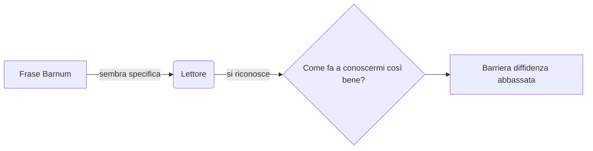
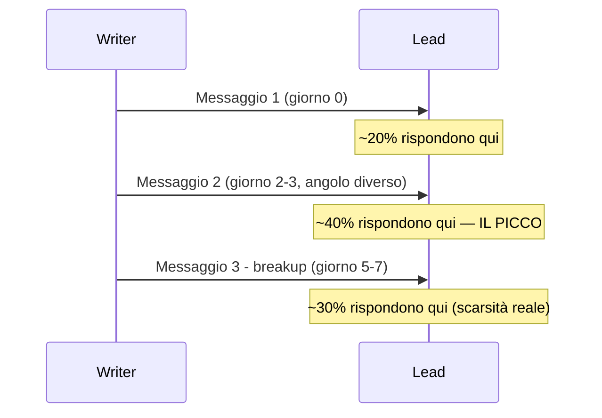
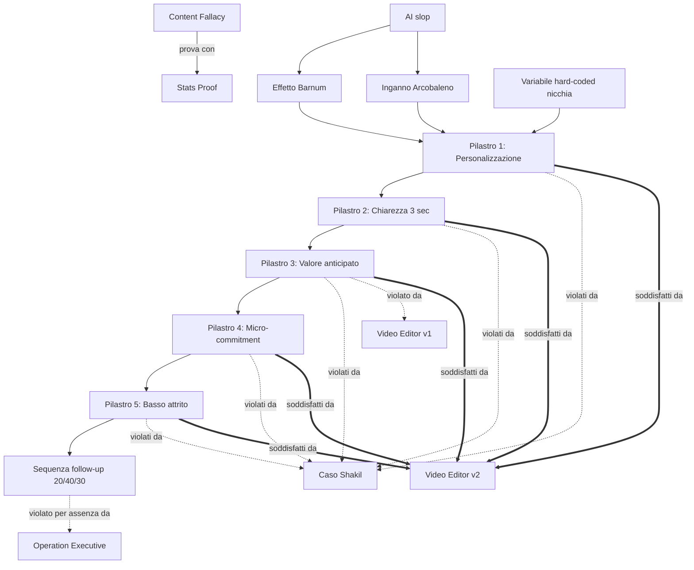

# Schemi — La Bibbia dei Messaggi

Raccolta consultabile di tutti gli schemi generati in `master.md`.

## 1. Inbound vs Outbound (Content Fallacy)
```
Post pubblico (inbound)          Outreach attivo (outbound)
────────────────────             ──────────────────────────
Costruisce autorità nel tempo    Genera pipeline ORA
Passivo, aspetta che ti notino   Proattivo, tu scegli il target
< 5% delle entrate reali         > 95% del "lavoro sporco" che converte
```

## 2. Meccanismo Effetto Barnum


## 3. Pilastro 3 — flusso valore anticipato
```
SENZA case study reale → NON dire "sono bravo" → CREA un case study artificiale
                                                  (lavoro gratuito mirato al lead specifico)
                                                  → poi chiedi un micro-commitment
```

## 4. Checklist di validazione (5 Pilastri) — riusata identica da rule-keeper e writer
| Pilastro | Presente? | Come verificarlo |
|---|---|---|
| 1. Personalizzazione | ? | C'è Barnum/Rainbow/variabile di nicchia nella prima riga? |
| 2. Chiarezza 3 sec | ? | Chi+perché comprensibili nei primi ~100 caratteri? |
| 3. Valore anticipato | ? | C'è un'offerta concreta PRIMA di qualunque richiesta? |
| 4. Micro-commitment | ? | La richiesta è minima (non una call)? |
| 5. Basso attrito | ? | L'azione richiesta è completabile in <10 secondi? |

## 5. Sequenza di follow-up (timeline)


## 6. Cross-reference generale del framework

