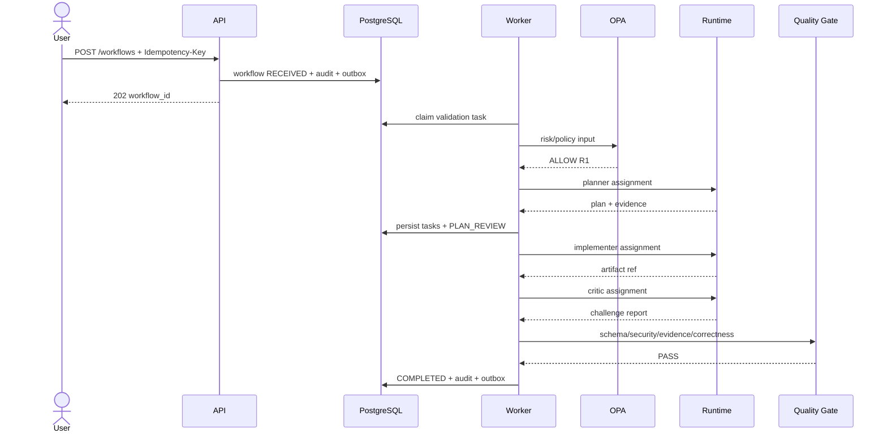
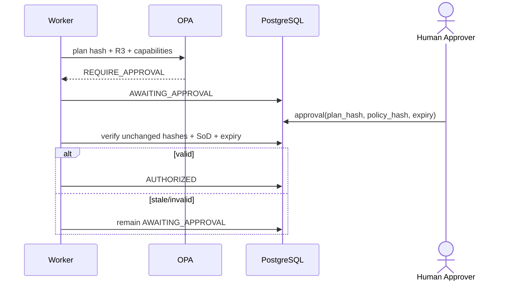

# LIVELLO 3/7 — Specifica eseguibile del sistema nervoso

**Versione:** 3.0.0  
**Sostituisce:** `level-02-contractual-architecture.md`  
**Stato:** PROPOSTO — attende approvazione umana  
**Focus:** trasformare l’architettura contrattuale in flussi, invarianti, schema dati, policy e test implementabili.  
**Baseline RuFlo osservata:** `ruvnet/ruflo@5234333`, root 3.38.16, Node ≥20.

---

## 1. Autocritica del Livello 2

| Difetto L2 | Diagnosi critica | Correzione L3 |
|---|---|---|
| Kubernetes scelto senza carico noto | over-engineering operativo | profilo container singolo predefinito; K8s solo con trigger |
| MCP `stdio` definito ma non protetto a livello processo | crash e output fuori protocollo possono corrompere sessione | bridge supervisor con framing, kill, restart e workspace isolata |
| RuFlo trattato come runtime coerente | alcuni tool osservati usano file locali e integrazioni best-effort | PostgreSQL resta autorità; RuFlo è executor non canonico |
| Capability matrix ancora vuota | integrazione non falsificabile | tool reali mappati e smoke protocol definito |
| State machine senza tabella transizioni | rischio di transizioni sparse nel codice | transition registry unico con guard ed evento |
| Contratti JSON esemplificativi | possono divergere tra Python e TypeScript | JSON Schema è source of truth; code generation/check CI |
| Schema SQL assente | impossibile provare lease, deduplica e outbox | DDL fisico e invarianti DB |
| OPA solo nominato | governance non eseguibile | policy Rego minima con casi test |
| Memory scoring arbitrario | falsa precisione | retrieval a due fasi e soglie validate su corpus |
| Benchmark con utility composita unica | i pesi possono nascondere regressioni | hard constraints prima del ranking |
| Builder Swarm definito ma non avviabile | manca task protocol | workflow di build con branch, artifact manifest e gate |
| Supply chain ignorata | RuFlo/npm/LLM aumentano rischio | pin, SBOM, provenance, scan e allowlist |

### Verdetto architetturale aggiornato

RuFlo non sarà il workflow state store, il policy engine o la memoria canonica. L’analisi del codice mostra tool MCP reali (`system_health`, `swarm_init`, `agent_spawn`, `agent_execute`, ecc.), ma anche persistenza locale e percorsi best-effort. È utile come **meta-harness di esecuzione**, non come fondamento transazionale.

---

## 2. Architettura L3: control plane autorevole, execution plane sostituibile

```text
┌──────────────────────────── CONTROL PLANE ────────────────────────────┐
│ API → Command Handler → Workflow Aggregate → PostgreSQL transaction  │
│                           │                  ├ state                   │
│                           │                  ├ task queue              │
│                           │                  ├ audit                   │
│                           │                  └ outbox                  │
│                           ├ OPA policy                                  │
│                           ├ Budget/Approval                             │
│                           └ Quality/Recovery                            │
└─────────────────────────────────┬──────────────────────────────────────┘
                                  │ TaskAssignment + capability grant
┌──────────────────────────── EXECUTION PLANE ──────────────────────────┐
│ Worker Supervisor                                                   │
│   ├ LocalRuntime                                                    │
│   ├ RuFloBridge → MCP stdio → pinned RuFlo → LLM provider           │
│   └ ToolSandbox → repository/artifact adapters                      │
└─────────────────────────────────┬──────────────────────────────────────┘
                                  │ untrusted result + evidence
                                  ▼
                         deterministic verification
```

### 2.1 Autorità dei dati

| Dato | Autorità | RuFlo può modificarlo? |
|---|---|---:|
| workflow/task status | PostgreSQL/control plane | No |
| budget residuo | PostgreSQL/control plane | No |
| policy/approval | OPA + approval record | No |
| capability grant | control plane | No |
| prompt execution/result grezzo | execution plane/artifact store | Sì, come proposta |
| swarm-local coordination | RuFlo | Sì, non canonico |
| memoria di progetto approvata | Memory service/PostgreSQL | No diretto |
| metriche runtime RuFlo | RuFlo/OTel | Sì, informative |

---

## 3. Profili di deployment realistici

| Profilo | Uso | Componenti | Trigger uscita |
|---|---|---|---|
| DEV | sviluppo locale | Docker Compose: API, worker, bridge, OPA, Postgres, OTel | nessuno |
| PILOT | pre-produzione/team singolo | managed container service, 2 API, 2 worker, managed Postgres | >20 workflow concorrenti o requisiti isolation |
| SCALE | produzione complessa | Kubernetes, autoscaling, network policy, PDB | adottato solo con evidenza |

Kubernetes non è più requisito iniziale. Lo diventa se almeno una condizione è vera:

- >20 workflow concorrenti sostenuti;
- isolamento per tenant tramite workload separati;
- >3 tipi worker con scaling indipendente;
- requisiti di availability non soddisfatti dal managed container service;
- team SRE capace di gestirlo.

---

## 4. Invarianti non negoziabili

| ID | Invariante | Enforcement |
|---|---|---|
| INV-01 | una transizione workflow incrementa `version` una sola volta | DB optimistic lock |
| INV-02 | stato + audit + outbox sono committati nella stessa transazione | Unit of Work |
| INV-03 | un risultato con lease/token scaduto non muta lo stato | worker guard |
| INV-04 | nessun side effect senza capability grant valido | Tool Gateway + OPA |
| INV-05 | nessun retry di side effect senza idempotency key | Recovery guard |
| INV-06 | R3 richiede approvazione umana step-up | OPA + approval table |
| INV-07 | output LLM è sempre non fidato | schema/security/evidence gate |
| INV-08 | RuFlo non scrive stato canonico | adapter boundary + DB ACL |
| INV-09 | NERVE-SAVE opera dopo correctness PASS | pipeline guard |
| INV-10 | record memoria senza provenienza non diventa ACTIVE | Memory Curator |
| INV-11 | autore e approvatore finale non coincidono per R2/R3 | policy SoD |
| INV-12 | budget consumato è monotono | DB check/atomic update |

Ogni invariante deve avere almeno un test negativo.

---

## 5. Transition Registry unico

```python
TRANSITIONS = {
  ("RECEIVED", "VALIDATING"): Transition(actor="api", guard="request_persisted"),
  ("VALIDATING", "PLANNING"): Transition(actor="worker", guard="validation_passed"),
  ("VALIDATING", "REJECTED"): Transition(actor="worker", guard="validation_failed"),
  ("PLANNING", "PLAN_REVIEW"): Transition(actor="worker", guard="plan_schema_valid"),
  ("PLAN_REVIEW", "AWAITING_APPROVAL"): Transition(actor="policy", guard="approval_required"),
  ("PLAN_REVIEW", "AUTHORIZED"): Transition(actor="policy", guard="policy_allowed"),
  ("AWAITING_APPROVAL", "AUTHORIZED"): Transition(actor="human", guard="approval_valid"),
  ("AUTHORIZED", "RUNNING"): Transition(actor="worker", guard="lease_and_budget_valid"),
  ("RUNNING", "RECOVERING"): Transition(actor="recovery", guard="retryable"),
  ("RECOVERING", "RUNNING"): Transition(actor="worker", guard="retry_scheduled"),
  ("RUNNING", "COMPENSATING"): Transition(actor="recovery", guard="compensation_required"),
  ("RUNNING", "QUALITY_REVIEW"): Transition(actor="worker", guard="all_required_tasks_done"),
  ("QUALITY_REVIEW", "REMEDIATING"): Transition(actor="gate", guard="remediation_available"),
  ("REMEDIATING", "RUNNING"): Transition(actor="worker", guard="remediation_task_created"),
  ("QUALITY_REVIEW", "COMPLETED"): Transition(actor="gate", guard="all_blocking_gates_pass"),
  ("QUALITY_REVIEW", "FAILED"): Transition(actor="gate", guard="terminal_quality_failure"),
  ("COMPENSATING", "COMPENSATED"): Transition(actor="recovery", guard="all_compensations_pass"),
  ("COMPENSATING", "MANUAL_INTERVENTION"): Transition(actor="recovery", guard="compensation_failed"),
}
```

### 5.1 Regole

- nessun `if status == ...` distribuito fuori dal registry;
- una transizione non registrata solleva `STATE_ILLEGAL_TRANSITION`;
- ogni guard restituisce `{allowed, reason_code, evidence_refs}`;
- terminali: `COMPLETED`, `FAILED`, `REJECTED`, `COMPENSATED`, `MANUAL_INTERVENTION`;
- `CANCELLED` sarà aggiunto solo con semantica di compensazione definita; non come shortcut.

---

## 6. Schema PostgreSQL fisico v0.1

```sql
CREATE TYPE risk_class AS ENUM ('R0','R1','R2','R3');
CREATE TYPE workflow_status AS ENUM (
  'RECEIVED','VALIDATING','PLANNING','PLAN_REVIEW','AWAITING_APPROVAL',
  'AUTHORIZED','RUNNING','PAUSED','RECOVERING','COMPENSATING',
  'QUALITY_REVIEW','REMEDIATING','COMPLETED','FAILED','REJECTED',
  'COMPENSATED','MANUAL_INTERVENTION'
);
CREATE TYPE task_status AS ENUM (
  'PENDING','BLOCKED','READY','LEASED','RUNNING','SUCCEEDED','FAILED',
  'RETRY_WAIT','COMPENSATING','COMPENSATED','CANCELLED'
);

CREATE TABLE workflows (
  workflow_id uuid PRIMARY KEY,
  tenant_id text NOT NULL,
  workflow_type text NOT NULL,
  risk risk_class NOT NULL,
  status workflow_status NOT NULL,
  goal text NOT NULL CHECK (length(goal) BETWEEN 1 AND 20000),
  constraints jsonb NOT NULL,
  budget_limit jsonb NOT NULL,
  budget_used jsonb NOT NULL DEFAULT '{"tokens":0,"cost_usd":0,"duration_ms":0}',
  idempotency_key text NOT NULL,
  requested_by text NOT NULL,
  version bigint NOT NULL DEFAULT 0 CHECK (version >= 0),
  sequence bigint NOT NULL DEFAULT 0 CHECK (sequence >= 0),
  deadline_at timestamptz,
  created_at timestamptz NOT NULL DEFAULT now(),
  updated_at timestamptz NOT NULL DEFAULT now(),
  UNIQUE (tenant_id, idempotency_key)
);

CREATE TABLE tasks (
  task_id uuid PRIMARY KEY,
  workflow_id uuid NOT NULL REFERENCES workflows(workflow_id),
  ordinal integer NOT NULL CHECK (ordinal >= 0),
  role text NOT NULL CHECK (role IN ('planner','implementer','critic','gate','compensator')),
  objective text NOT NULL,
  status task_status NOT NULL,
  depends_on uuid[] NOT NULL DEFAULT '{}',
  max_attempts smallint NOT NULL CHECK (max_attempts BETWEEN 1 AND 3),
  attempt smallint NOT NULL DEFAULT 0 CHECK (attempt >= 0),
  ready_at timestamptz NOT NULL DEFAULT now(),
  leased_by text,
  leased_until timestamptz,
  execution_token_hash text,
  capability_grant_id uuid,
  input_ref text NOT NULL,
  output_ref text,
  failure_code text,
  version bigint NOT NULL DEFAULT 0,
  created_at timestamptz NOT NULL DEFAULT now(),
  updated_at timestamptz NOT NULL DEFAULT now(),
  UNIQUE (workflow_id, ordinal)
);
CREATE INDEX ix_tasks_claim ON tasks (ready_at, created_at)
  WHERE status IN ('READY','RETRY_WAIT');
CREATE INDEX ix_tasks_workflow ON tasks (workflow_id, ordinal);

CREATE TABLE task_runs (
  task_run_id uuid PRIMARY KEY,
  task_id uuid NOT NULL REFERENCES tasks(task_id),
  attempt smallint NOT NULL,
  runtime text NOT NULL,
  runtime_version text NOT NULL,
  prompt_hash text NOT NULL,
  started_at timestamptz NOT NULL,
  ended_at timestamptz,
  status text NOT NULL,
  usage jsonb NOT NULL DEFAULT '{}',
  output_ref text,
  failure jsonb,
  UNIQUE(task_id, attempt)
);

CREATE TABLE approvals (
  approval_id uuid PRIMARY KEY,
  workflow_id uuid NOT NULL REFERENCES workflows(workflow_id),
  subject_id text NOT NULL,
  auth_context jsonb NOT NULL,
  decision text NOT NULL CHECK (decision IN ('APPROVE','REJECT')),
  plan_hash text NOT NULL,
  policy_hash text NOT NULL,
  expires_at timestamptz NOT NULL,
  created_at timestamptz NOT NULL DEFAULT now()
);

CREATE TABLE capability_grants (
  grant_id uuid PRIMARY KEY,
  workflow_id uuid NOT NULL REFERENCES workflows(workflow_id),
  task_id uuid NOT NULL REFERENCES tasks(task_id),
  subject text NOT NULL,
  capabilities jsonb NOT NULL,
  constraints jsonb NOT NULL,
  token_hash text NOT NULL UNIQUE,
  expires_at timestamptz NOT NULL,
  revoked_at timestamptz
);

CREATE TABLE gate_runs (
  gate_run_id uuid PRIMARY KEY,
  workflow_id uuid NOT NULL REFERENCES workflows(workflow_id),
  task_id uuid REFERENCES tasks(task_id),
  gate_id text NOT NULL,
  rubric_version text NOT NULL,
  artifact_hash text NOT NULL,
  attempt smallint NOT NULL,
  verdict text NOT NULL CHECK (verdict IN ('PASS','REMEDIATE','REJECT','ESCALATE')),
  blocking_failures jsonb NOT NULL DEFAULT '[]',
  criteria jsonb NOT NULL,
  created_at timestamptz NOT NULL DEFAULT now(),
  UNIQUE(gate_id, artifact_hash, attempt)
);

CREATE TABLE audit_events (
  audit_id bigint GENERATED ALWAYS AS IDENTITY PRIMARY KEY,
  event_id uuid NOT NULL UNIQUE,
  tenant_id text NOT NULL,
  workflow_id uuid NOT NULL,
  sequence bigint NOT NULL,
  actor_type text NOT NULL,
  actor_id text NOT NULL,
  event_type text NOT NULL,
  payload jsonb NOT NULL,
  payload_hash text NOT NULL,
  trace_id text NOT NULL,
  occurred_at timestamptz NOT NULL,
  UNIQUE(workflow_id, sequence)
);

CREATE TABLE outbox_events (
  event_id uuid PRIMARY KEY,
  aggregate_id uuid NOT NULL,
  event_type text NOT NULL,
  schema_version text NOT NULL,
  payload jsonb NOT NULL,
  occurred_at timestamptz NOT NULL,
  published_at timestamptz,
  attempts smallint NOT NULL DEFAULT 0,
  last_error text
);
CREATE INDEX ix_outbox_unpublished ON outbox_events (occurred_at)
  WHERE published_at IS NULL;

CREATE TABLE memory_records (
  memory_id uuid PRIMARY KEY,
  tenant_id text NOT NULL,
  namespace text NOT NULL,
  content_ref text NOT NULL,
  content_hash text NOT NULL,
  summary text NOT NULL,
  provenance jsonb NOT NULL,
  confidence numeric(4,3) NOT NULL CHECK (confidence BETWEEN 0 AND 1),
  classification text NOT NULL,
  acl jsonb NOT NULL,
  status text NOT NULL,
  valid_from timestamptz NOT NULL,
  valid_until timestamptz,
  supersedes uuid REFERENCES memory_records(memory_id),
  created_at timestamptz NOT NULL DEFAULT now(),
  UNIQUE(tenant_id, namespace, content_hash)
);
```

### 6.1 Correzioni richieste prima del codice

- RLS PostgreSQL per tenant;
- check JSON Schema applicativo su JSONB;
- trigger vietati per logica di dominio;
- partizionamento audit solo dopo volume misurato;
- UUIDv7 generati applicativamente;
- cifratura storage gestita dal provider; field encryption solo per dati classificati.

---

## 7. Protocollo transazionale

Ogni command usa questo ordine:

1. `BEGIN`;
2. carica aggregate con tenant filter;
3. verifica expected version;
4. applica command nel dominio;
5. aggiorna aggregate `WHERE version=:old`;
6. inserisce task/checkpoint necessari;
7. inserisce audit event;
8. inserisce outbox event;
9. `COMMIT`;
10. publisher asincrono consegna outbox.

Se lo step 5 aggiorna zero righe: rollback e `STATE_CONFLICT`; massimo tre retry immediati con reload.

### 7.1 Claim task

```sql
WITH candidate AS (
  SELECT task_id
  FROM tasks
  WHERE status IN ('READY','RETRY_WAIT')
    AND ready_at <= now()
    AND (leased_until IS NULL OR leased_until < now())
  ORDER BY ready_at, created_at
  FOR UPDATE SKIP LOCKED
  LIMIT 1
)
UPDATE tasks t
SET status='LEASED', leased_by=:worker, leased_until=now()+interval '30 seconds',
    execution_token_hash=:token_hash, version=version+1, updated_at=now()
FROM candidate c
WHERE t.task_id=c.task_id
RETURNING t.*;
```

Heartbeat ogni 10 s; lease 30 s; estensione negata se workflow in pausa, cancellazione o budget esaurito.

---

## 8. Flussi critici

### 8.1 Success path R1



### 8.2 R3 approval



### 8.3 Runtime timeout

```text
agent timeout
→ mark TaskRun FAILED/RUN_TIMEOUT
→ verify deadline, budget, idempotency, attempts, breaker
→ R0/R1: one retry; optionally LocalRuntime fallback with explicit audit
→ R2/R3: no silent runtime substitution; PAUSED or approval
→ terminal failure with side effect: COMPENSATING
```

### 8.4 Worker crash after external side effect

```text
Tool Gateway sends idempotency_key
→ service completes side effect
→ worker crashes before DB commit
→ lease expires
→ new worker replays same idempotency_key
→ service returns prior result
→ worker verifies result hash
→ commits SUCCEEDED once
```

Se il servizio non supporta idempotenza, la skill è classificata non-retryable e richiede reconciliation/compensation specifica.

### 8.5 Compensation failure

```text
COMPENSATING
→ execute reverse dependency order
→ compensation result persisted per step
→ failure: no infinite retry
→ MANUAL_INTERVENTION
→ DLQ record + critical alert + runbook link
```

---

## 9. Policy OPA minima

```rego
package orchestration.authorization

import rego.v1

default decision := {"effect": "DENY", "reasons": ["POL_DEFAULT_DENY"]}

forbidden_capabilities := {"host.root", "secrets.read_all", "policy.write"}

has_forbidden if {
  some cap in input.requested_capabilities
  cap in forbidden_capabilities
}

same_author_approver if {
  input.approval.requested_by == input.approval.approved_by
}

decision := {"effect": "DENY", "reasons": ["POL_FORBIDDEN_CAPABILITY"]} if has_forbidden

decision := {"effect": "DENY", "reasons": ["POL_SEPARATION_OF_DUTIES"]} if {
  input.risk in {"R2", "R3"}
  same_author_approver
}

decision := {"effect": "REQUIRE_APPROVAL", "reasons": ["POL_R3_HUMAN_APPROVAL"]} if {
  input.risk == "R3"
  not has_forbidden
}

decision := {"effect": "REQUIRE_APPROVAL", "reasons": ["POL_R2_SIDE_EFFECT"]} if {
  input.risk == "R2"
  input.has_external_side_effect
  not has_forbidden
}

decision := {"effect": "ALLOW", "reasons": ["POL_LOW_RISK"]} if {
  input.risk in {"R0", "R1"}
  not has_forbidden
  input.budget.within_limit
  input.skill.status == "ACTIVE"
}
```

### 9.1 Test policy obbligatori

- default deny su campo mancante;
- deny capability proibita in ogni risk class;
- R3 richiede human approval;
- approvatore uguale all’autore: deny;
- approval con plan hash vecchio: deny applicativo;
- skill revocata: deny;
- budget esaurito: deny;
- unknown capability: deny.

OPA decide autorizzazione; la validazione di hash, scadenza e firma resta nel control plane.

---

## 10. Contratti JSON Schema come source of truth

### 10.1 Regole

- directory `contracts/schemas/v1/`;
- JSON Schema Draft 2020-12;
- `additionalProperties: false` sui boundary esterni;
- semver: campo aggiunto opzionale = minor, breaking = major;
- Pydantic e TypeScript generati/verificati in CI;
- fixture valide e invalide per ogni schema;
- hash schema incluso in TaskAssignment e AgentResult.

### 10.2 Invarianti `TaskAssignment`

- `maxTokens`: 1–50000;
- `timeoutSeconds`: 1–300;
- `maxCostUsd`: 0–20 per task nel pilot;
- capability matcha allowlist sintattica;
- `executionToken` formato opaco, mai loggato;
- `contextRefs` massimo 20;
- objective massimo 8000 caratteri;
- output schema obbligatorio.

### 10.3 Invarianti `Plan`

- 1–5 task normali;
- DAG aciclico validato con topological sort;
- ogni task ha completion criteria;
- ogni side effect dichiara idempotency/compensation;
- budget task totale ≤ budget workflow;
- nessuna capability task eccede quelle del workflow;
- almeno un gate finale.

---

## 11. RuFlo: mappatura reale e limiti

### 11.1 Tool MCP verificati nel codice della baseline

| Porta interna | Tool RuFlo candidato | Stato L3 | Osservazione critica |
|---|---|---|---|
| health | `system_health` | CANDIDATE | swarm/neural possono risultare `unknown`; non basta per readiness |
| swarm create | `swarm_init` | CANDIDATE | persiste coordination record locale |
| swarm inspect | `swarm_status` | CANDIDATE | non sostituisce stato canonico |
| agent register | `agent_spawn` | CANDIDATE | registra agente; descrizione distingue più execution path |
| agent run | `agent_execute` | CANDIDATE | chiamata provider reale; richiede configurazione provider/key |
| agent inspect | `agent_status` | CANDIDATE | diagnostica runtime |
| agent stop | `agent_terminate` | CANDIDATE | cleanup best-effort da testare |
| swarm stop | `swarm_shutdown` | CANDIDATE | cleanup da testare |
| memory search | `memory_search` | DEFERRED | non canonica v0.1 |
| memory write | `memory_store` | DEFERRED | vietata come write canonica |

### 11.2 Configurazione swarm pilot

```json
{
  "topology": "hierarchical",
  "maxAgents": 4,
  "config": {
    "communicationProtocol": "message-bus",
    "consensusMechanism": "majority",
    "failureHandling": "retry",
    "loadBalancing": false,
    "autoScaling": false
  },
  "metadata": {
    "workflow_id": "uuid",
    "non_canonical": true
  }
}
```

Auto-scaling disattivo; max 4, non il default osservato di 15. Le topologie avanzate non entrano nel pilot.

### 11.3 Smoke certification

Per ogni tool:

1. avvia `npx ruflo@<pinned> mcp start` in workspace temporanea;
2. MCP initialize/list tools;
3. verifica nome e input schema hash;
4. esegue happy path;
5. esegue invalid input;
6. timeout/cancel;
7. restart processo e verifica semantica persistence;
8. registra stdout/stderr redatti, durata, exit code, versione;
9. confronta con golden response normalizzata;
10. classifica `SUPPORTED`, `DEGRADED`, `UNSUPPORTED`.

### 11.4 Readiness indipendente

`ruflo_bridge /ready` è verde solo se:

- processo MCP vivo;
- initialize completato;
- tool allowlist presente con schema hash atteso;
- provider configurato senza esporre key;
- una probe non fatturabile o a costo controllato passa;
- breaker non open.

`system_health` è segnale aggiuntivo, non verdetto unico.

---

## 12. RuFlo Bridge Supervisor

### 12.1 Stato

`STOPPED → STARTING → HANDSHAKING → READY → DEGRADED → RESTARTING → OPEN`

### 12.2 Controlli

- child process senza shell interpolation;
- UID non-root;
- filesystem: workspace dedicata, root readonly;
- env allowlist; secret in memoria e non ereditati inutilmente;
- stdout riservato al protocollo; stderr redatto e limitato;
- output frame massimo 4 MiB;
- timeout handshake 10 s;
- timeout tool dal TaskAssignment, massimo 300 s;
- massimo 3 restart in 5 minuti, poi breaker OPEN;
- kill `SIGTERM`, grace 5 s, poi `SIGKILL`;
- cleanup agent/swarm best-effort, mai bloccare recovery canonico.

### 12.3 Mapping errori

| MCP/RuFlo | Interno |
|---|---|
| process exit | `RUN_UNAVAILABLE` |
| method/tool missing | `RUN_CAPABILITY_MISMATCH` |
| schema changed | `RUN_SCHEMA_DRIFT` |
| timeout | `RUN_TIMEOUT` |
| provider auth | `RUN_PROVIDER_AUTH` non retryable |
| rate limit | `RUN_RATE_LIMIT` retryable entro deadline |
| malformed response | `RUN_PROTOCOL_ERROR` |

---

## 13. Flusso mentale e agenti v3

### 13.1 Separazione cognition/control

```text
Cognition propone: intent, piano, artefatto, critica.
Control verifica: schema, rischio, policy, budget, capacità, transizione.
Evidence collega: claim → fonte/hash/test.
Memory conserva: solo contenuto classificato e governato.
```

### 13.2 Contratto dei quattro agenti

| Agente | Deve produrre | Causa FAIL |
|---|---|---|
| PLANNER | DAG, criteri, capability, budget, rischi, side effect | ciclo, task ambiguo, budget overflow |
| IMPLEMENTER | artifact ref, claim-evidence map, test manifest | scrittura fuori scope, claim senza evidenza |
| CRITIC | issue classificati e test di falsificazione | giudizio senza citazione o fix |
| GATE | criterio per criterio, hash artefatto, verdict | PASS senza prova o rubrica errata |

### 13.3 Anti-collusione

- modelli/provider diversi per Implementer e Critic quando economicamente possibile;
- Critic non vede il self-score dell’Implementer;
- Gate riceve artefatto, rubrica e prove, non la persuasione narrativa completa;
- remediation modifica solo issue dichiarate, salvo regression fix;
- due remediation fallite → human escalation, non nuovo agente infinito.

---

## 14. Plan Memory Agent v3

### 14.1 Ingestion

1. legge solo `plans/level-*.md`;
2. calcola SHA-256 del file;
3. estrae heading tree e blocchi con line range;
4. assegna `level`, `status`, `supersedes`;
5. indicizza testo e keyword; embedding opzionale dopo benchmark;
6. registra manifest immutabile;
7. non indicizza file cambiato senza nuova versione/checkpoint.

### 14.2 Retrieval deterministico-first

```text
query
→ filtro livello approvato/tenant/ACL
→ exact heading + keyword BM25
→ semantic retrieval opzionale
→ merge con reciprocal rank fusion
→ rerank per autorità: livello più alto approvato > precedente
→ massimo 8 chunk / 6000 token
→ risposta con file, heading, line range, hash
```

### 14.3 Difesa da memoria contaminata

- piani sono trusted solo dopo approvazione;
- note e output agenti entrano `QUARANTINED`;
- istruzioni trovate nei documenti vengono trattate come dati citati;
- retrieval non concede capability;
- content hash verificato prima dell’uso;
- conflitti esplicitati, mai fusi silenziosamente;
- query log senza contenuto sensibile completo.

### 14.4 Test

- domanda coperta da L1 ma corretta in L3: deve prevalere L3;
- piano PROPOSTO vs APPROVATO: deve dichiarare lo stato;
- file alterato: hash mismatch e quarantine;
- prompt injection in nota: nessuna escalation privilege;
- query senza evidenza: risposta `INSUFFICIENT_EVIDENCE`.

---

## 15. Builder Swarm: workflow eseguibile

```text
WORK_ITEM_CREATED
→ BUILD-LEAD valida scope/acceptance/file ownership
→ ARCHITECT produce/aggiorna ADR se necessario
→ RUFLO-SCOUT certifica capability coinvolte
→ IMPLEMENTER lavora in branch/worktree isolato
→ TESTER esegue suite immutabile
→ SECURITY esegue threat checks/SAST/dependency scan
→ GATEKEEPER verifica artifact manifest e criteri
→ PASS: merge candidate
→ FAIL ≤2: remediation mirata
→ FAIL 3 / critical: freeze + human review
```

### 15.1 Artifact Manifest

```json
{
  "work_item": "WI-...",
  "base_commit": "sha",
  "result_commit": "sha",
  "changed_files": [],
  "contracts_changed": [],
  "migrations": [],
  "tests": [{"suite": "unit", "result": "PASS", "report_ref": "artifact://..."}],
  "security": {"critical": 0, "high": 0, "sbom_ref": "artifact://..."},
  "evidence_hash": "sha256:...",
  "known_risks": [],
  "rollback": "git revert <sha>"
}
```

### 15.2 Prima tranche del team di costruzione

| Work item | Owner | Dipende da | Gate |
|---|---|---|---|
| WI-001 repository + CI skeleton | IMPLEMENTER | ADR-001 | build reproducible |
| WI-002 contracts source of truth | ARCHITECT | WI-001 | schema fixtures |
| WI-003 state machine pure domain | IMPLEMENTER | WI-002 | property tests |
| WI-004 PostgreSQL UoW/lease/outbox | IMPLEMENTER | WI-003 | crash/concurrency |
| WI-005 OPA policy | SECURITY | WI-002 | deny tests |
| WI-006 LocalRuntime vertical slice | IMPLEMENTER | WI-003/5 | e2e R1 |
| WI-007 RuFlo certification harness | RUFLO-SCOUT | WI-002 | smoke evidence |
| WI-008 bridge | IMPLEMENTER | WI-007 | contract parity |
| WI-009 Plan Memory Agent read-only | IMPLEMENTER | WI-002 | citation tests |
| WI-010 benchmark A/B/C | TESTER | WI-006/8 | statistical report |

---

## 16. Test architecture

| Livello | Bersaglio | Criterio |
|---|---|---|
| Unit | value object, budget, guards | branch coverage critica 100% |
| Property | DAG/state/budget/idempotency | nessuna sequenza viola invarianti |
| Contract | JSON Schema, OPA, runtime ports | provider consumer parity |
| Integration | Postgres, OPA, bridge | container reali |
| E2E | workflow R1 | artifact + audit + recovery |
| Security | injection, capability, secret, tenant | zero bypass |
| Chaos | worker kill, MCP crash, DB transient | recupero entro RTO |
| Benchmark | A/B/C | hard constraint + delta utility |

### 16.1 Scenari minimi

1. duplicate POST stessa idempotency key;
2. due worker claim simultaneo;
3. lease scade mentre arriva risultato vecchio;
4. OPA down: fail closed per nuove azioni;
5. RuFlo cambia schema tool;
6. prompt injection dentro repository;
7. budget esaurito durante agent execution;
8. approval scade o plan hash cambia;
9. output corretto ma NERVE-SAVE elimina warning: test deve fallire;
10. compensation fallisce e produce manual intervention.

---

## 17. Supply-chain e runtime security

- dipendenze Python e npm con lockfile e hash;
- RuFlo pin esatto nel pilot, non `latest`;
- Dependabot/Renovate apre PR, non auto-merge major/minor sensibili;
- SBOM CycloneDX per immagine;
- immagini firmate con Cosign e provenance SLSA-compatible;
- scan secret, SAST, dependency e container;
- base image minimale, non-root, read-only filesystem;
- network egress allowlist per provider/servizi autorizzati;
- tool execution in sandbox senza Docker socket;
- prompt, output e artifact sottoposti a size limit;
- kill switch per runtime RuFlo e per ogni skill R2/R3;
- aggiornamento RuFlo passa certification harness e canary.

---

## 18. SLO e dimensionamento del pilot

| SLI | Target pilot | Finestra |
|---|---:|---:|
| API create availability | 99.5% | 30 giorni |
| workflow R1 completion | ≥95% esclusi input invalidi | 100 run |
| state recovery dopo worker kill | ≤45 s p95 | chaos suite |
| duplicate side effect | 0 | sempre |
| audit completeness | 100% transizioni | sempre |
| policy bypass | 0 | sempre |
| bridge cold start | ≤10 s p95 | 100 start |
| orchestration overhead | ≤25% wall time p95 | benchmark |

### 18.1 Trigger per NATS

Introdurre NATS solo se PostgreSQL queue mostra uno dei seguenti:

- claim latency p95 >250 ms per 15 minuti;
- >50 task/s sostenuti;
- fan-out a >3 consumer indipendenti;
- backlog recovery non soddisfa RTO;
- DB CPU attribuibile alla queue >20%.

---

## 19. Benchmark corretto

### 19.1 Hard constraints prima del punteggio

Una variante è eliminata se:

- security bypass >0;
- artifact non riproducibile;
- completion <90%;
- evidence coverage <95% sui claim obbligatori;
- side effect duplicato;
- budget massimo superato.

### 19.2 Ranking tra varianti sopravvissute

Metriche riportate separatamente: correctness, evidence, completion, costo, latenza, token, interventi umani. Nessuna utility composita nasconde una regressione. La utility L2 resta solo analisi di sensibilità con almeno tre set di pesi.

### 19.3 Promozione RuFlo swarm

- supera LocalRuntime multi-role su correctness o evidence di ≥10%;
- bootstrap CI 95% del delta >0;
- costo ≤2.5×;
- nessuna hard constraint fallita;
- operatività bridge non aumenta incident rate >5 punti percentuali.

Se non passa, RuFlo resta capability sperimentale. Questa è una possibile conclusione corretta, non un fallimento del progetto.

---

## 20. Piano file-per-file in ordine di costruzione

```text
1  docs/adr/001..006.md                 decisioni prima del codice
2  contracts/schemas/v1/*.json         source of truth boundary
3  contracts/fixtures/{valid,invalid}/  test contract
4  src/orchestrator/domain/*.py         aggregate e invarianti pure
5  tests/property/test_state_machine.py verifica transizioni
6  migrations/versions/001_core.py      schema fisico
7  adapters/postgres/{uow,repos,queue,outbox}.py
8  tests/integration/test_recovery.py   crash/lease/dedup
9  policies/*.rego + tests              default deny
10 api/{schemas,routes,auth}.py          command surface
11 worker/{leasing,supervisor,main}.py   execution loop
12 adapters/local_runtime/*.py           baseline
13 skills/repository-adr/*               primo caso reale
14 quality/{schema,security,evidence}.py gate pre-compressione
15 quality/nerve_save.py                 adapter package esistente
16 ruflo_bridge/certification/*          prova tool reali
17 ruflo_bridge/src/*                    supervisor e mapping
18 memory/{plan_ingest,retrieval}.py     Plan Memory Agent read-only
19 deploy/compose/*                      ambiente pilot riproducibile
20 observability/*                       dashboard/alert/runbook
21 benchmarks/*                          decisione A/B/C
```

Nessun file viene creato solo per completare l’albero; ogni file nasce da un work item e un test.

---

## 21. Fasi di produzione aggiornate

| Fase | Durata indicativa | Exit gate |
|---|---:|---|
| P0 Decision lock | 3–5 giorni | ADR e contratti approvati |
| P1 Deterministic core | 1–2 settimane | property tests invarianti |
| P2 Durable execution | 1–2 settimane | kill/recovery/dedup pass |
| P3 Governance + sandbox | 1–2 settimane | security bypass zero |
| P4 Local vertical slice | 1 settimana | 30 e2e R1 pass |
| P5 RuFlo certification/bridge | 1–2 settimane | tool schema + chaos pass |
| P6 Memory/quality/observability | 1–2 settimane | citation/non-loss/trace pass |
| P7 Benchmark/hardening | 2 settimane | decisione RuFlo e readiness report |

Range totale confermato: **9–12 settimane**, esclusi compliance specifica, UI di approvazione avanzata e multi-region.

---

## 22. Quality Gate L3 → L4

| ID | Criterio | Evidenza richiesta |
|---|---|---|
| C1 | autorità control/execution separate | authority matrix |
| C2 | invarianti complete e testabili | INV-01..12 + negative tests |
| C3 | transition registry unico | tabella/registry |
| C4 | schema SQL supporta lease/outbox/audit | DDL review |
| C5 | protocollo transazionale atomico | UoW sequence |
| C6 | flussi success/approval/retry/crash/compensation | diagrammi |
| C7 | policy default-deny concreta | Rego + test matrix |
| C8 | JSON Schema è source of truth | versioning/generation rules |
| C9 | tool RuFlo reali mappati senza autorità canonica | capability table |
| C10 | certification harness definito | 10-step smoke protocol |
| C11 | bridge supervisionato e fail-closed | state/error map |
| C12 | Plan Memory Agent deterministico-first e sicuro | ingestion/retrieval/test |
| C13 | Builder Swarm avviabile per work item | WI-001..010 |
| C14 | supply-chain coperta | pin/SBOM/sign/scan |
| C15 | benchmark usa hard constraints | protocollo promozione |
| C16 | deployment proporzionato | DEV/PILOT/SCALE triggers |
| C17 | approvazione umana | via esplicito |

**Soglia:** 17/17.

---

## 23. Autocritica del Livello 3

### Miglioramento reale rispetto a L2

- elimina Kubernetes come default non giustificato;
- definisce autorità dei dati e impedisce a RuFlo di diventare stato canonico;
- rende state machine, DDL, lease, UoW e outbox implementabili;
- include policy Rego concreta e default deny;
- usa nomi tool RuFlo osservati nel repository;
- riconosce limiti reali di health e persistenza RuFlo;
- rende Plan Memory Agent interrogabile e testabile;
- converte il Builder Swarm in una pipeline di work item;
- introduce supply-chain security e hard constraints benchmark.

### Debolezze residue per L4

1. DDL non include ancora RLS policy, indici di audit e piano backup/restore completo.
2. La semantica di cancellazione è deliberatamente incompleta.
3. La compensazione resta skill-specifica; manca un catalogo formale.
4. I prompt completi dei quattro agenti non sono ancora versionati.
5. Non è stato eseguito il certification harness: i tool sono CANDIDATE, non SUPPORTED.
6. MCP stdio resta fragile per alta concorrenza.
7. OPA è un ulteriore componente operativo e manca il failure-cache model.
8. Artifact store production non scelto.
9. Auth provider, cloud, data residency e compliance restano aperti.
10. I target SLO non derivano ancora da misure reali.
11. Il threat model non copre STRIDE per ogni boundary.
12. Non esiste un modello di capacity/cost per provider LLM.

### Punteggio comparativo

| Dimensione | L2 | L3 |
|---|---:|---:|
| Realismo | 9.2 | 9.5 |
| Specificità | 8.7 | 9.3 |
| Implementabilità | 8.1 | 9.0 |
| Sicurezza | 8.5 | 9.0 |
| Testabilità | 8.8 | 9.4 |
| Evidenza RuFlo | 6.0 | 8.2 |
| Readiness production | 6.5 | 7.5 |

**Verdetto:** L3 è una specifica sufficiente per iniziare un vertical slice controllato, ma il processo resta bloccato fino al Livello 7 per volontà del programma. L4 dovrà concentrarsi su sicurezza, resilienza, cancellazione, compensazioni, backup/restore e failure behavior di ogni dipendenza.